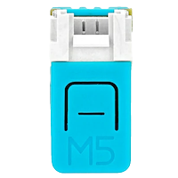

# Moddable SDKでESP32を使用する
Copyright 2016-2024 Moddable Tech, Inc.<BR>
改訂： 2024年5月23日

このドキュメントは、EspressifのESP32シリーズのSoC向けにアプリを構築するためのガイドを提供します。Moddable SDKは、[ESP32](https://www.espressif.com/en/products/socs/esp32)、[ESP32-S2](https://www.espressif.com/en/products/socs/esp32-s2)、[ESP32-S3](https://www.espressif.com/en/products/socs/esp32-s3)、[ESP32-C3](https://www.espressif.com/en/products/socs/esp32-c3)、[ESP32-C6](https://www.espressif.com/en/products/socs/esp32-c6)、および[ESP32-H2](https://www.espressif.com/en/products/socs/esp32-h2)をサポートしています。

## 目次

* [概要](#overview)
* [プラットフォーム](#platforms)
	* [ESP32](#platforms-esp32)
	* [ESP32-S2](#platforms-esp32-s2)
	* [ESP32-S3](#platforms-esp32-s3)
	* [ESP32-C3](#platforms-esp32-c3)
	* [ESP32-C6](#platforms-esp32-c6)
	* [ESP32-H2](#platforms-esp32-h2)
	* [マニフェストでESP32サブクラスを指定する](#platforms-manifest)
* [ビルドタイプ](#builds)
	* [デバッグ](#build-debug)
	* [instrumented](#build-instrumented)
	* [リリース](#build-release)
* セットアップ手順


	| [](#mac) | [](#win) | [](#lin) |
	| :--- | :--- | :--- |
	| •  [インストール](#mac-instructions)<BR>•  [トラブルシューティング](#mac-troubleshooting)<!-- <BR>•  [更新](#mac-update) --> | •  [インストール](#win-instructions)<BR>•  [トラブルシューティング](#win-troubleshooting)<!-- <BR>•  [更新](#win-update) --> | •  [インストール](#lin-instructions)<BR>•  [トラブルシューティング](#lin-troubleshooting)<!-- <BR>•  [更新](#lin-update) -->

* [トラブルシューティング](#troubleshooting)
* [ESP32でのUSBの使用](#using_usb)
	* [マルチポートデバイス](#usb_multiport)
	* [ビルド構成](#usb_build)
	* [TinyUSB](#usb_tinyusb) (esp32s2, esp32s3)
	* [シリアル-JTAG](#usb_serial_jtag) (esp32s3, esp32c3, esp32c6, esp32h2)

<a id="overview"></a>
## 概要

アプリケーションをビルドする前に、以下を行う必要があります：

- Moddable SDKをインストールし、そのツールをビルドする
- ESP32プラットフォーム用の必要なドライバーと開発ツールをインストールする

以下の手順では、コマンドラインツール`mcconfig`を使用してデバイス上で`helloworld`のサンプルを実行することで、セットアップを確認します。

> 詳細については、[ツールのドキュメント](./../tools/tools.md)を参照してください。

`mcconfig`を使用してビルドする際には、開発ボードの**プラットフォーム識別子**を`-p`引数に指定してデバイスターゲットを設定します。例えば、Moddable Two用にビルドするには、次のコマンドを使用します。

```text
mcconfig -d -m -p esp32/moddable_two
```

利用可能なESP32、ESP32-S2、ESP32-S3、ESP32-C3、ESP32-C6およびESP32-H2のサブプラットフォームとそのプラットフォーム識別子のリストは、以下の**プラットフォーム**セクションに記載されています。

<a id="platforms"></a>
## プラットフォーム

<a id="platforms-esp32"></a>
### ESP32

ESP32には以下の機能があります：

- 240 MHzプロセッサ
- デュアルコア
- Wi-Fi
- BLE
- 520 KB RAM
- 4 MBフラッシュ

Moddable SDKは、ESP32上に構築された多くのデバイスをサポートしています。以下の表は、各デバイス、そのプラットフォーム識別子、デバイス固有の主要機能のリスト、および追加リソースへのリンクを示しています。

| 名前 | プラットフォーム識別子 | 主要機能 | リンク |
| :---: | :--- | :--- | :--- |
| <BR>Moddable Two | `esp32/moddable_two`<BR>`simulator/moddable_two` | **2.4" IPSディスプレイ**<BR>240 x 320 QVGA<BR>16ビットカラー<BR>静電容量式タッチ<BR><BR>20 外部ピン  | <li>[Moddable Two 開発者ガイド](./moddable-two.md)</li><li>[Moddable 製品ページ](https://www.moddable.com/hardware)</li> |
| <BR>Moddable Display 2 | `esp32/moddable_display_2`<BR>`simulator/moddable_two` | **2.4" IPSディスプレイ**<BR>240 x 320 QVGA<BR>16ビットカラー<BR>静電容量式タッチ<BR><BR>20 外部ピン  | <li>[Moddable Display 開発者ガイド](./moddable-display.md)</li><li>[Moddable 製品ページ](https://www.moddable.com/hardware)</li> |
| <BR>Node MCU ESP32 | `esp32/nodemcu` | |
| <BR> M5Stack | `esp32/m5stack`<BR>`esp32/m5stack_core2` | **1.8" LCDディスプレイ**<BR>320 x 240 QVGA<BR>16ビットカラー<BR><BR>オーディオ再生<BR>加速度計<BR>NeoPixels  | <li>[製品ページ](https://m5stack.com/collections/m5-core/products/basic-core-iot-development-kit)</li> |
| <BR>M5Stack Fire | `esp32/m5stack_fire` | **1.8" LCDディスプレイ**<BR>320 x 240 QVGA<BR>16ビットカラー<BR><BR>オーディオ再生<BR>加速度計<BR>NeoPixels | <li>[製品ページ](https://m5stack.com/collections/m5-core/products/fire-iot-development-kit?variant=16804798169178)</li> |
| <BR>M5Stick C | `esp32/m5stick_c`<BR>`simulator/m5stick_c` | **0.96" LCDディスプレイ**<BR>80 x 160<BR>16ビットカラー<BR><BR>IMU<BR>マイクロフォン | <li>[製品ページ](https://m5stack.com/collections/m5-core/products/stick-c?variant=17203451265114)</li> |
| <BR>M5Stick C PLUS | `esp32/m5stick_cplus` | **1.14" LCDディスプレイ**<BR>135 x 240<BR>16ビットカラー<BR><BR>IMU<BR>マイクロフォン | <li>[製品ページ](https://docs.m5stack.com/en/core/m5stickc_plus)</li> |
|  <BR>M5Atom | `esp32/m5atom_echo`<BR>`esp32/m5atom_lite`<BR>`esp32/m5atom_matrix` | 5 x 5 RGB LEDマトリックスパネル<BR><BR>MPU6886慣性センサー<BR>6 外部ピン | <li>[製品ページ](https://m5stack.com/collections/m5-atom/products/atom-matrix-esp32-development-kit)</li> |
|  <BR>M5AtomU | `esp32/m5atom_u` | Neopixel、1ボタン<BR>マイクロフォン<BR>6 外部ピン | <li>[製品ページ](https://docs.m5stack.com/en/core/atom_us)</li> |
|  <BR>M5 Paper | `esp32/m5paper`<BR>`simulator/m5paper` | **960 x 540 ePaperタッチスクリーン**<BR>温度センサー | <li>[製品ページ](https://shop.m5stack.com/products/m5paper-esp32-development-kit-960x540-4-7-eink-display-235-ppi?variant=37595977908396)</li><li>[Moddable SDK ドキュメント](./m5paper.md)</li> |
| <BR>M5Core Ink | `esp32/m5core_ink ` | **200 x 200 ePaperディスプレイ**<BR>ブザー<BR>ダイヤル | <li>[製品ページ](https://shop.m5stack.com/products/m5stack-esp32-core-ink-development-kit1-54-elnk-display)</li><li>[Moddable SDK ドキュメント](./m5core_ink.md)</li> |
|  <BR> Heltec WiFi Kit 32 | `esp32/heltec_wifi_kit_32` | **128 x 64 OLEDディスプレイ** | <li>[製品ページ](https://heltec.org/project/wifi-kit-32/)</li> |
|  <BR> Wemos OLED Lolin32 | `esp32/wemos_oled_lolin32` | **128 x 64 OLEDディスプレイ**<BR>内蔵LEDなし | <li>[追加情報](https://randomnerdtutorials.com/esp32-built-in-oled-ssd1306/)</li> |
|  <BR>SparkFun Thing | `esp32/esp32_thing` | | <li>[製品ページ](https://www.sparkfun.com/products/13907)</li> |
|  <BR>SparkFun Thing Plus | `esp32/esp32_thing_plus ` | | <li>[製品ページ](https://www.sparkfun.com/products/15663)</li> |
| <BR>ESP32 WRover Kit | `esp32/wrover_kit` | | <li>[製品ページ](https://www.adafruit.com/product/3384)</li> |
|  <BR> Wireless Tag WT32-ETH01 | `esp32/wt32_eth01` | **内蔵イーサネット** | <li>[製品ページ](http://www.wireless-tag.com/portfolio/wt32-eth01/)</li> |
| <BR>Lilygo TTGO | `esp32/lilygo_ttgo` | **135 x 240 IPSディスプレイ**<br>ボタン | <li>[製品ページ](https://www.lilygo.cc/products/lilygo%C2%AE-ttgo-t-display-1-14-inch-lcd-esp32-control-board)</li> |
| Moddable Zero | `esp32/moddable_zero` | | <li>[配線ガイド](../displays/wiring-guide-generic-2.4-spi-esp32.md)</li> |

<a id="platforms-esp32-s2"></a>
### ESP32-S2

ESP32-S2には以下の機能があります：

- 240 MHzプロセッサ
- Wi-Fi
- 320 KB RAM
- 外部SRAMサポート
- 一般的なモジュールには4 MBフラッシュ

Moddable SDKはEspressifの2つのESP32-S2開発キットをサポートしています。以下の表は各デバイス、そのプラットフォーム識別子、デバイス固有の主要機能のリスト、および追加リソースへのリンクを示しています。

| 名前 | プラットフォーム識別子 | 主要機能 | リンク |
| :---: | :--- | :--- | :--- |
|  <BR>Kaluga | `esp32/kaluga` | **3.2インチLCDディスプレイ**<BR>320 x 240 QVGA<BR>16ビットカラー<BR><BR>2 MB SRAM<BR>スピーカーとオーディオ再生<BR>タッチパッドパネル<BR>NeoPixel LED | <li>[Moddableブログ記事](https://blog.moddable.com/blog/espidf42/)</li><li>[製品ページ](https://docs.espressif.com/projects/esp-idf/en/latest/esp32s2/hw-reference/esp32s2/user-guide-esp32-s2-kaluga-1-kit.html)</li> |
|  <BR>Saola<BR>(WROOM & WROVERバージョン) | `esp32/saola_wroom` <BR> `esp32/saola_wrover`| NeoPixel LED<BR>2 MB SRAM (WROVERバージョンのみ)| <li>[Moddableブログ記事](https://blog.moddable.com/blog/espidf42/)</li><li>[製品ページ](https://docs.espressif.com/projects/esp-idf/en/latest/esp32s2/hw-reference/esp32s2/user-guide-saola-1-v1.2.html)</li> |
| <BR>Adafruit<BR>QT Py ESP32-S2 | `esp32/qtpys2` |  Neopixel、1ボタン、STEMMA/QWIIC | <li>[製品ページ](https://www.adafruit.com/product/5325)</li>|
| </a><BR>ili9341 | `esp32/qtpys2_ili9341` | ili9341 QVGAディスプレイ<BR>320 x 240<BR>16ビットカラー | <li>[配線ガイド](../displays/images/xiao-qtpy-ili9341-wiring.png)</li> |
| <BR>Lolin<BR>S2 Mini | `esp32/lolin_s2mini` |  1ボタン | <li>[製品ガイド](https://www.wemos.cc/en/latest/s2/s2_mini.html)</li>

<a id="platforms-esp32-s3"></a>
### ESP32-S3

ESP32-S3は、オリジナルのESP32の後継機です。以下の特徴があります：

- 240 MHzプロセッサ（デュアルコア）
- Wi-Fi
- BLE
- 512 KB RAM
- 外部PSRAMサポート
- 人気のあるモジュールに8 MBフラッシュ

Moddable SDKはESP32-S3上に構築されたデバイスをサポートしています。以下の表は、各デバイス、そのプラットフォーム識別子、デバイス固有の主要機能のリスト、および追加リソースへのリンクを示しています。

| 名前 | プラットフォーム識別子 | 主要機能 | リンク |
| :---: | :--- | :--- | :--- |
|  <BR>ESP32-S3-DevKitC-1-N8 | `esp32/esp32s3` | |<li>[製品ページ](https://docs.espressif.com/projects/esp-idf/en/latest/esp32s3/hw-reference/esp32s3/user-guide-devkitc-1.html)</li> |
|  <BR>Adafruit QT Py ESP32-S3 | `esp32/qtpys3` | Neopixel、1ボタン、STEMMA/QWIIC  | <li>[製品ページ](https://www.adafruit.com/product/5426)</li> |
|  <BR>Adafruit ESP32-S3 TFT Feather | `esp32/feather_s3_tft` | 1.14インチTFTディスプレイ<BR> 240 x 135 16ビットカラー | <li>[製品ページ](https://www.adafruit.com/product/5483)</li>|
|<BR>AtomS3| `esp32/m5atom_s3` |  0.85インチIPSディスプレイ<BR> 128 x 128 16ビットカラー<BR> 1ボタン<BR> IMU |<li>[製品ページ](https://docs.m5stack.com/en/core/AtomS3)</li>|
|<BR>AtomS3 Lite| `esp32/m5atom_s3_lite` | Neopixel、1ボタン |<li>[製品ページ](https://docs.m5stack.com/en/core/AtomS3%20Lite)</li>|
|<BR>M5Dial| `esp32/m5dial` | 1.28インチIPS 240×240円形ディスプレイ、タッチ、1ボタン、ロータリーエンコーダ、RTC |<li>[製品ページ](https://docs.m5stack.com/en/core/M5Dial)</li>|
|<BR>M5Stamp S3| `esp32/m5stamp_s3` | Neopixel、1ボタン |<li>[製品ページ](https://shop.m5stack.com/products/m5stamp-esp32s3-module)</li>|
| <BR>Lilygo T-QT ESP32-S3 | `esp32/lilygo_t_qt` | 0.85インチLCDディスプレイ<br>128 x 128 16ビットカラー<br>2ボタン<br>Qwiicコネクタ | <li>[製品ページ](https://www.lilygo.cc/products/t-qt-v1-1)</li>|
| <BR>Lilygo T-Display-S3 | `esp32/lilygo_tdisplay_s3` | 1.9インチLCDディスプレイ<br>170 x 320 16ビットカラー<br>8ビットパラレルディスプレイ<br>タッチ<br>2ボタン<br>Qwiicコネクタ<br> | <li>[製品ページ](https://www.lilygo.cc/products/t-display-s3)</li>|
| <BR>Seeed Studio<BR>XIAO ESP32S3 | `esp32/xiao_esp32s3` | 1ボタン | <li>[製品ページ](https://www.seeedstudio.com/XIAO-ESP32S3-p-5627.html)</li>|
| </a><BR>ili9341 | `esp32/qtpys3_ili9341`<br>`esp32/xiao_esp32s3_ili9341` | ili9341 QVGAディスプレイ<BR>320 x 240<BR>16ビットカラー | <li>[配線ガイド](../displays/images/xiao-qtpy-ili9341-wiring.png)</li> |

<a id="platforms-esp32-c3"></a>
### ESP32-C3

ESP32-C3には以下の機能があります：

- 160 MHz RISC-V MCU
- Wi-Fi
- BLE
- 400 KB RAM
- 人気のあるモジュールに4 MBフラッシュメモリ

Moddable SDKは3つのESP32-C3開発キットをサポートしています：

| 名前 | プラットフォーム識別子 | 主な機能 | リンク |
| :---: | :--- | :--- | :--- |
|  <BR>ESP32-C3-DevKitM-1 | `esp32/esp32c3` |  | <li>[製品ページ](https://docs.espressif.com/projects/esp-idf/en/latest/esp32c3/hw-reference/esp32c3/user-guide-devkitm-1.html)</li> |
|  <BR>ESP32 C3 DevKitクローン| `esp32/esp32c3_cdc` |  | <li>[製品ページ](https://docs.espressif.com/projects/esp-idf/en/latest/esp32c3/hw-reference/esp32c3/user-guide-devkitm-1.html)</li> |
|  <BR>ESP32-C3-DevKit-RUST-1 | `esp32/c3_devkit_rust` |  | <li>[製品ページ](https://www.espressif.com/en/dev-board/esp32-c3-devkit-rust-1-en)</li> |
| <BR>Seeed Studio<BR>XIAO ESP32C3 | `esp32/xiao_esp32c3` | 1ボタン | <li>[製品ページ](https://www.seeedstudio.com/Seeed-XIAO-ESP32C3-p-5431.html)</li>|
| <BR>Adafruit<BR>QT Py ESP32-C3 | `esp32/qtpyc3` |  Neopixel, 1ボタン, STEMMA/QWIIC | <li>[製品ページ](https://www.adafruit.com/product/5405)</li>|
| AI Thinker ESP-C3-32S-Kit <BR> (1 MBおよび2 MBバージョン) | `esp32/c3_32s_kit` <BR> `esp32/c3_32s_kit_2m`| RGB LED  | <li>[製品仕様](https://docs.ai-thinker.com/_media/esp32/docs/esp-c3-32s-kit-v1.0_specification.pdf)</li> |
| </a><BR>ili9341 | `esp32/qtpyc3_ili9341`<br>`esp32/xiao_esp32c3_ili9341` | ili9341 QVGAディスプレイ<BR>320 x 240<BR>16ビットカラー | <li>[配線ガイド](../displays/images/xiao-qtpy-ili9341-wiring.png)</li> |
| <BR>Lolin<BR>C3 Mini | `esp32/lolin_c3mini` |  1ボタン | <li>[製品ガイド](https://www.wemos.cc/en/latest/c3/c3_mini.html)</li>
| <BR>Lolin<BR>C3 Pico | `esp32/lolin_c3pico` |  Neopixel, 1ボタン | <li>[製品ガイド](https://www.wemos.cc/en/latest/c3/c3_pico.html)</li>

<a id="platforms-esp32-c6"></a>
### ESP32-C6

ESP32-C6には以下の機能があります：

- 160 MHz RISC-V MCU
- Wi-Fi
- BLE
- 512 KB RAM
- 人気のあるモジュールに4 MBフラッシュメモリ

Moddable SDKは3つのESP32-C6開発キットをサポートしています：

| 名前 | プラットフォーム識別子 | 主な機能 | リンク |
| :---: | :--- | :--- | :--- |
|  <BR>ESP32-C6-DevKitC-1 | `esp32/esp32c6` | NeoPixel、ボタン | <li>[製品ページ](https://docs.espressif.com/projects/espressif-esp-dev-kits/en/latest/esp32c6/esp32-c6-devkitc-1/user_guide.html)</li> |
|  <BR>M5NanoC6 | `esp32/m5nanoc6` | LED、NeoPixel、ボタン | <li>[製品ページ](https://docs.m5stack.com/en/core/M5NanoC6)</li> |

<a id="platforms-esp32-h2"></a>
### ESP32-H2

ESP32-H2には以下の機能があります：

- 96 MHz RISC-V MCU
- BLE
- 320 KB RAM
- 人気のあるモジュールに4 MBフラッシュメモリ

Moddable SDKは3つのESP32-H2開発キットをサポートしています：


| Name | Platform identifier | Key features | Links |
| :---: | :--- | :--- | :--- |
|  <BR>ESP32-H2-DevKitM-1 | `esp32/esp32h2` | NeoPixel、ボタン | <li>[製品ページ](https://docs.espressif.com/projects/espressif-esp-dev-kits/en/latest/esp32h2/esp32-h2-devkitm-1/user_guide.html)</li> |

<a id="platforms-manifest"></a>
### マニフェストでESP32サブクラスを指定する

ビルドのターゲットESP32サブクラスは、マニフェストの`build`セクションで`ESP32_SUBCLASS`プロパティを使用して指定します。これは通常、ターゲットビルドデバイスのマニフェストによって設定されます。以下の例は、サブクラスをESP32-S2に設定する方法を示しています。


```
"build":{
	"ESP32_SUBCLASS": "esp32s2"
},
```

| `ESP32_SUBCLASS` | デバイス |
|:---:|:---:|
| `esp32` または未設定 | ESP32 |
| `esp32s2` | ESP32-S2 |
| `esp32s3` | ESP32-S3 |
| `esp32c3` | ESP32-C3 |
| `esp32c6` | ESP32-C6 |
| `esp32h2` | ESP32-H2 |

<a id="builds"></a>
## ビルドタイプ
ESP32は、デバッグ、instrumented、およびリリースの3種類のビルドをサポートしています。各ビルドは、製品開発プロセスの異なる段階に適しています。どの種類のビルドを行うかは、コマンドラインから選択します。

<a id="build-debug"></a>
### デバッグ
デバッグビルドはJavaScriptのデバッグに使用されます。デバッグビルドでは、ESP-IDFのロギングが無効化され、GDBスタブは存在しません。

`mcconfig` コマンドラインで `-d` オプションを使用すると、デバッグビルドが選択されます。

<a id="build-instrumented"></a>
### instrumented
instrumentedビルドはネイティブコードのデバッグに使用されます。instrumentedビルドでは、ESP-IDFのロギングが有効化され、GDBスタブが存在します。JavaScriptデバッガは無効化されます。通常、xsbugで利用可能な計測データは、1秒ごとにシリアルコンソールに出力されます。

`mcconfig` コマンドラインで `-i` オプションを使用すると、instrumentedビルドが選択されます。

<a id="build-release"></a>
### リリース
リリースビルドは本番用です。リリースビルドでは、ESP-IDFのロギングが無効化され、GDBスタブは存在せず、JavaScriptデバッガは無効化され、instrumented統計は収集されず、シリアルコンソールの出力も抑制されます。

`mcconfig` コマンドラインで `-d` および `-i` オプションを省略すると、リリースビルドが選択されます。なお、`-r` はリリースビルドの選択ではなく、回転を指定します。

<a id="mac"></a>
## macOS

Moddable SDKのESP32用ビルドは現在、ESP-IDF v5.2.2（コミット `3b8741b1`）およびEspressifの[`idf.py`ツール](https://github.com/espressif/esp-idf/blob/master/tools/idf.py)のCMakeオプションを使用しています。

<a id="mac-instructions"></a>
### インストール

1. [Getting Startedドキュメント](./../Moddable%20SDK%20-%20Getting%20Started.md)に従って、Moddable SDKツールをインストールします。

2. 必要なサードパーティのSDKおよびツールのために、ホームディレクトリに`~/esp32`という名前の`esp32`ディレクトリを作成します。

3. macOS 10.15（Catalina）以前のバージョンを使用している場合は、Silicon Labsの[CP210x USB to UART VCPドライバ](https://www.silabs.com/products/development-tools/software/usb-to-uart-bridge-vcp-drivers)をダウンロードしてインストールします。

	macOS Catalinaを使用している場合、VCPドライバを有効にするために追加の手順が必要です。インストール中に「システム拡張がブロックされました」というポップアップが表示された場合は、ダイアログの指示に従ってセキュリティとプライバシーのシステム環境設定で拡張機能を有効にしてください。


もし、macOS 10.16 (Big Sur) 以降を使用している場合、VCPドライバーをインストールする必要はありません。

4. 初めてインストールする場合は、`ESP-IDF` GitHubリポジトリを `~/esp32` ディレクトリにクローンします。必ず `--recursive` オプションを指定してください。`v5.2.2` タグをチェックアウトすることを忘れないでください：

	```text
	cd ~/esp32
	git clone -b v5.2.2 --recursive https://github.com/espressif/esp-idf.git esp-idf-v5.2.2
	```

5. (オプション）Homebrewを更新し、Python、cmake、ninja、pipパッケージ管理システム、およびpyserialをインストールします。すでに古いバージョンがインストールされている場合は、それらのパッケージを `brew upgrade` でアップグレードします：

	```text
	brew update
	brew install python3 cmake ninja dfu-util
	brew upgrade python3 cmake ninja dfu-util
	pip install pyserial
	```

6. USBケーブルを使用してESP32デバイスをmacOSホストに接続します。

7. シェルのスタートアップ/初期化ファイルを開きます。

	macOS Mojave以前の場合、デフォルトのシェルは `bash` なので、`~/.profile` を開く必要があります。

	```text
	open ~/.profile
	```


	macOS Catalinaから、[デフォルトのシェルは `zsh` です](https://support.apple.com/en-us/HT208050)。したがって、`~/.zshrc` を開いてください。

	```text
	open ~/.zshrc
	```

8. 開いたファイルに次の行を追加して保存します。これにより、`IDF_PATH` 環境変数がESP-IDFディレクトリを指すように設定されます。

	```text
	export IDF_PATH=$HOME/esp32/esp-idf-v5.2.2
	```

	<a id="upload_port_mac"></a>
	上級ユーザー向けにオプションの環境変数が1つあります： `UPLOAD_PORT`。

	ESP-IDFビルド/設定ツール `idf.py` はほとんどの場合シリアルポートを自動的に検出します。検出しない場合は、使用するポートのパスを `UPLOAD_PORT` 環境変数に設定します。

	```text
	export UPLOAD_PORT=/dev/cu.SLAB_USBtoUART
	```

	適切なシリアルポートを特定するには、ESP32デバイスを接続する前後のmacOSのシリアルデバイスのリストを確認し、新しく表示されるシリアルポートをメモします。シリアルデバイスファイルのリストを表示するには、ターミナルで次のコマンドを使用します。

```text
ls /dev/cu.*
```

`UPLOAD_PORT` は `mcconfig` コマンドラインでも指定でき、複数のESP32デバイスにデプロイする際に便利です。

```text
UPLOAD_PORT=/dev/cu.SLAB_USBtoUART mcconfig -d -m -p esp32
```

9. `~/.profile` や `~/.zshrc` にエクスポート文を追加しても、アクティブなシェルインスタンスの環境変数は更新されませんので、新しいシェルインスタンスを開く（新しいタブ/ウィンドウを開く）か、シェルで手動でエクスポート文を実行してから続行してください。

10. ESP-IDFインストールスクリプトを実行します。これにより、ESP-IDFビルドに必要な適切なクロスコンパイルツールチェーンとユーティリティがインストールされます。

```text
cd $IDF_PATH
./install.sh
```

M1チップを搭載したMacを使用している場合、インストールスクリプトを実行する前に追加の手順が必要です。これは、ESP-IDFがまだDarwin-arm64ホストを適切にサポートしていないためです。[このコメント](https://github.com/espressif/esp-idf/issues/6113#issuecomment-756335935) には、この問題を回避するための手順が記載されています。

11. ビルド環境を設定するために、ESP-IDFの`export.sh`スクリプトをソースにします。**これは新しいシェルインスタンスを開くたびに__毎回__実行する必要があります。**手動で実行するか、スタートアップスクリプトで実行してください。

	```text
	source $IDF_PATH/export.sh
	```

	新しいシェルインスタンスのためにこのプロセスを自動化したい場合は、上記のステップ7-9の指示に従い、シェルのスタートアップ/初期化スクリプトの最後に`source`コマンドを追加してください。`export IDF_PATH`コマンドの後に追加することを確認してください。

12. デバイスターゲット用に`helloworld`をビルドしてセットアップを確認します：

	```text
	cd ${MODDABLE}/examples/helloworld
	mcconfig -d -m -p esp32/<YOUR_SUBPLATFORM_HERE>
	```

	> ESP32ターゲット用にアプリケーションを初めてビルドする際、ツールチェーンが設定オプションの入力を求めることがあります。この場合、デフォルトを受け入れてください。

<a id="mac-troubleshooting"></a>
### トラブルシューティング

アプリケーションをインストールしようとすると、エラーや警告の形で障害に遭遇することがあります。このセクションでは、macOSでの一般的な問題とその解決方法について説明します。

他のmacOS、Windows、およびLinuxで共通の問題については、このドキュメントの下部にある[トラブルシューティングセクション](#troubleshooting)を参照してください。

#### デバイスが接続されていない/認識されない

次のエラーメッセージは、デバイスがコンピュータに接続されていないか、コンピュータがデバイスを認識していないことを意味します。

```text
error: cannot access /dev/cu.SLAB_USBtoUART
error: cannot access /dev/usbserial-0001
```

これが発生する理由はいくつかあります：

1. デバイスがコンピュータに接続されていません。ビルドコマンドを実行するときに接続されていることを確認してください。
2. 電源のみのUSBケーブルを使用しています。データ同期可能なUSBケーブルを使用していることを確認してください。
3. 別のアプリケーションがシリアルポートに接続されています。例えば、シリアルモニターがポートを開いている可能性があります。アプリケーションを閉じるか、デバイスをアプリケーションから切断してください。
4. コンピュータがデバイスを認識しません。この問題を解決するためには、以下の指示に従ってください。

デバイスを取り外し、次のコマンドを入力します。

```text
ls /dev/cu*
```

次に、デバイスを接続し、同じコマンドを再度実行します。ターミナル出力に新しいものが表示されない場合、デバイスはコンピュータに認識されていません。

macOS 10.15以前を使用している場合は、正しいVCPドライバーがインストールされていることを確認してください。macOS 10.16以前を使用している場合は、VCPドライバーをインストールする必要はありません。

認識された場合、デバイス名が取得され、`UPLOAD_PORT`環境変数を編集する必要があります。以下のコマンドを入力し、`/dev/cu.SLAB_USBtoUART`をシステム上のデバイス名に置き換えてください。

```text
export UPLOAD_PORT=/dev/cu.SLAB_USBtoUART
```

#### SSL証明書エラー

EspressifはPython 3への移行を推奨しています。Python 2.7は推奨されていません。

しかし、Python 2.7を使用していて、ESP-IDFのビルド中にSSL証明書エラーが発生する場合は、Python 2.7と必要なパッケージを手動でインストールする必要があります。追加のコンポーネントをインストールするために、[brew](https://brew.sh/)と[pip](https://pypi.org/project/pip/)を使用しました。

```text
brew install python
brew install python@2
pip install future
pip install pyserial
pip install cryptography
```

<a id="mac-update"></a>
### 更新

これは大幅なアップデートです。クリーンクローンから始めるのが最善です。

0. ディスクスペースに余裕がある場合は、古いESP-IDFをバックアップすることをお勧めします。

	```text
	cd ~/esp32/
	mv esp-idf esp-idf.old
	```

1. ディレクトリを削除し、リポジトリをクローンします。

	```text
	cd ~/esp32
	rm -rf esp-idf
	git clone -b v5.2.2 --recursive https://github.com/espressif/esp-idf.git
	```

2. （オプション - おそらくこれを行う必要はありません）Homebrewを更新し、必要なツールがすべて揃っていることと、それらが最新であることを確認します：

	```text
	brew update
	brew install python cmake ninja
	brew upgrade python cmake ninja
	pip install pyserial
	```

3. `IDF_PATH` 環境変数がシェルのユーザープロファイルファイル（例：`~/.profile` または `~/.zshrc`、シェルによって異なります）に正しく設定されていることを確認します。

	```text
   export IDF_PATH=$HOME/esp32/esp-idf
	```

4. ESP-IDFインストールスクリプトを実行します。これにより、ESP-IDFビルドに必要な適切なクロスコンパイルツールチェーンとユーティリティがインストールされます。


	```text
	cd $IDF_PATH
	./install.sh
	```

5. ESP-IDFの`export.sh`スクリプトをソースにしてビルド環境をセットアップします。**これは新しいシェルインスタンスを開くたびに手動で、またはスタートアップスクリプトによって実行する必要があります。**

	```text
	source $IDF_PATH/export.sh
	```

	新しいシェルインスタンスのためにこのプロセスを自動化したい場合は、上記のステップ3の指示に従い、シェルのスタートアップ/初期化スクリプトの最後に`source`コマンドを追加します。`export IDF_PATH`コマンドの後に追加することを確認してください。

<!-- Tools autobuild now
6. `$MODDABLE/build/bin/esp32`または`$MODDABLE/build/tmp/esp32`に既存のESP32ビルド出力がある場合は、それらのディレクトリを削除します:

    ```text
    cd $MODDABLE/build
    rm -rf bin/esp32
    rm -rf tmp/esp32
    ```

7. デバイスターゲット用に`helloworld`をビルドしてセットアップを確認します:

	```text
	cd ${MODDABLE}/examples/helloworld
	mcconfig -d -m -p esp32/<YOUR_SUBPLATFORM_HERE>
	```

	> ESP32ターゲット用にアプリケーションを初めてビルドする際、ツールチェーンが設定オプションの入力を求めることがあります。この場合、デフォルトを受け入れてください。


-->

<a id="win"></a>
## Windows

Moddable SDKのESP32用ビルドは現在、ESP-IDF v5.2.2（コミット `3b8741b1`）およびEspressifの[`idf.py`ツール](https://github.com/espressif/esp-idf/blob/master/tools/idf.py)のCMakeオプションを使用しています。

<a id="win-instructions"></a>
### インストール

1. [Getting Startedドキュメント](./../Moddable%20SDK%20-%20Getting%20Started.md)の指示に従って、Moddable SDKツールをインストールします。

2. Silicon Labsの[CP210x USB to UART VCPドライバ](https://www.silabs.com/products/development-tools/software/usb-to-uart-bridge-vcp-drivers)をダウンロードしてインストールします。ドライバのzipファイルには、x64およびx86バージョンのインストーラが含まれています。ほとんどの最新のPCは64ビット版のWindowsを実行しているため、x64バージョンのVCPドライバを使用する必要があります。32ビット版のWindowsを実行している場合は、x86バージョンのドライバを使用してください。（コンピュータが64ビット版のWindowsを実行しているかどうかは、システム設定の「PCの情報」で確認できます）

3. Espressifの[ESP-IDF Windowsインストーラ](https://dl.espressif.com/dl/esp-idf/?idf=5.2.2)をダウンロードして実行します。これにより、ESP32 Xtensa gccツールチェーン、Ninja Build、OpenOCD、およびKConfigフロントエンドがインストールされます。このツールは、必要に応じて新しくダウンロードされたツールを含むように`PATH`を設定します。

インストーラーのデフォルトオプションをすべて受け入れるか、必要に応じてインストール場所を変更しても安全です。

CMakeやPythonがまだインストールされていない場合、インストーラーはそれらのツールをダウンロードしてインストールするように促します（必要に応じてインストールしてください）。

インストーラーはESP-IDFのgitリポジトリをクローンするオプションを提供します。このオプションを選択する場合は、「v5.2.2（リリースバージョン）」オプションを選択し、ホームフォルダ内の`esp32\esp-idf`というディレクトリにクローンしてください。

4. ESP-IDFをESP-IDF Windowsインストーラーを使用してクローンしなかった場合、ホームフォルダに`esp32`ディレクトリを作成します。これは、ファイルエクスプローラーまたはコマンドプロンプトから行います：

    ```text
    cd %USERPROFILE%
    mkdir esp32
    ```

5. ESP-IDFをESP-IDF Windowsインストーラーを使用してクローンしなかった場合、`ESP-IDF` Githubリポジトリを`~/esp32`ディレクトリにクローンします。必ず`--recursive`オプションを指定してください。その後、`v5.2.2`タグをチェックアウトします：

    ```text
    cd %USERPROFILE%\esp32
    git clone -b v5.2.2 --recursive https://github.com/espressif/esp-idf.git
    ```

既にESP-IDFのクローンコピーを持っている場合、最も簡単な更新方法は既存の`esp-idf`フォルダーを削除して再度クローンすることです。[EspressifのESP-IDFの取得方法を参照](https://docs.espressif.com/projects/esp-idf/en/v5.2.2/esp32/get-started/index.html#get-started-get-esp-idf)

6. USBケーブルを使ってESP32デバイスをWindowsホストに接続します。

7. [これらの指示](https://www.architectryan.com/2018/08/31/how-to-change-environment-variables-on-windows-10/)に従って、コントロールパネルアプリの「環境変数」ダイアログを開きます。そのダイアログから：
	- `IDF_PATH`という名前のユーザー変数を作成し、ESP-IDFをクローンしたディレクトリに設定します。例：
		- 変数名： `IDF_PATH`
		- 変数値（「ディレクトリを参照。..」ボタンを使用してこの選択を行います）: `C:\Users\<user>\esp32\esp-idf`

	<a id="upload_port_win"></a>
	上級ユーザー向けのオプションの環境変数が1つあります：`UPLOAD_PORT`。<br><br>
	ESP-IDFビルド/設定ツール`idf.py`はほとんどの場合シリアルポートを自動的に検出します。検出しない場合は、上記と同じ手順で`UPLOAD_PORT`環境変数に使用するポートのパスを設定します。

- `UPLOAD_PORT`: デバイスのCOMポート、例：`COM3`

  正しいシリアルポートを特定するには、Windowsデバイスマネージャを起動します。「ポート (COM & LPT)」セクションを開き、「Silicon Labs CP210x USB to UART Bridge」が表示されていることを確認し、関連するCOMポート（例：COM3）をメモします。

8. 新しく設定された環境変数は既存のコマンドプロンプトインスタンスでは有効にならないため、これらの変更を適用した後に新しいコマンドプロンプトインスタンスを開くようにしてください。

9. ESP-IDFインストールバッチファイルを実行します。これにより、ESP-IDFビルドに使用されるユーティリティがマシンに対して設定されます。

    ```text
    cd %IDF_PATH%
    install.bat
    ```

10. ESP-IDF Windowsインストーラーは、重要な環境変数とパスを自動的に設定する「ESP-IDF 5.2.2 CMD」と呼ばれるコマンドプロンプトを提供します。「ESP-IDF 5.2.2 CMD」でESP32プロジェクトをビルドすることをお勧めします。新しいコマンドプロンプトインスタンスごとに、Visual Studio x86初期化バッチファイルを手動で実行する必要があります。システムに応じてパスを調整してください。

```text
"C:\Program Files\Microsoft Visual Studio\2022\Community\VC\Auxiliary\Build\vcvars32.bat"
```

**専門家向けの注意:** Windowsのショートカットを編集することに慣れている場合、この手動プロセスの便利な代替手段として、「ESP-IDF 5.2.2 CMD」ショートカットを変更して、ESP-IDF環境とVisual Studio x86環境の両方を初期化することができます。これを行うには、「ESP-IDF 5.2.2 CMD」ショートカットを右クリックして「プロパティ」を選択します。プロパティウィンドウの「ターゲット」フィールドには、次のようなコマンドが表示されます。

```text
C:\WINDOWS\system32\cmd.exe /k "C:\Users\<username>\.espressif\idf_cmd_init.bat"
```

ターゲットを次のように変更して、`vcvars32.bat`へのパスを含めることができます。システムに合わせてパスを調整してください。

```text
%comspec% /k ""%ProgramFiles%\Microsoft Visual Studio\2022\Community\VC\Auxiliary\Build\vcvars32.bat" && pushd %IDF_PATH% && "%IDF_TOOLS_PATH%\idf_cmd_init.bat" && popd"
```

また、ショートカットの「作業フォルダー」フィールドを `%MODDABLE%` に更新して、Moddable SDKディレクトリでコマンドプロンプトセッションを開始することも便利です。

	> 注: これらの指示は、ESP-IDF が1つだけインストールされていることを前提としています。必要に応じて、`idf_cmd_init.bat` に特定の ESP-IDF インストールを指定する引数を渡すこともできます。この引数は、デフォルトの "ESP-IDF 5.2.2 CMD" ショートカットで設定する必要があります。

11. "ESP-IDF 5.2.2 CMD" コマンドプロンプトで、デバイスターゲット用に `helloworld` をビルドしてセットアップを確認します：

	```text
	cd %MODDABLE%\examples\helloworld
	mcconfig -d -m -p esp32/<YOUR_SUBPLATFORM_HERE>
	```

<a id="win-troubleshooting"></a>
### トラブルシューティング

アプリケーションをインストールしようとすると、エラーや警告の形で障害が発生することがあります。このセクションでは、Windowsでの一般的な問題とその解決方法について説明します。

macOS、Windows、およびLinuxで共通のその他の問題については、このドキュメントの最後にある[トラブルシューティングセクション](#troubleshooting)を参照してください。

#### ESP-IDF のビルドが非常に遅い

Windows 10および11に含まれている組み込みのウイルス対策ソフトウェア（Microsoft Defender、以前のWindows Defender）は、ESP-IDFのビルドを大幅に遅くする可能性があります。Espressifの[ESP-IDF Windows インストーラー](https://dl.espressif.com/dl/idf-installer/esp-idf-tools-setup-online-2.23.exe)には、ビルド中のリアルタイムスキャンを回避するために必要なすべての除外設定を自動的に構成するオプションが含まれています。ビルドが遅い場合は、ESP-IDF Windowsインストーラーを再実行して、そのオプションが選択されていることを確認してください。また、[これらの指示](https://support.microsoft.com/en-us/windows/add-an-exclusion-to-windows-security-811816c0-4dfd-af4a-47e4-c301afe13b26)に従って、Moddableビルドフォルダーやその他のカスタムビルド出力ディレクトリを手動で除外する必要がある場合もあります。


#### Python バージョン

Espressifは、ESP-IDF v5.2.2でビルドする際にPython 3.9以降の使用を推奨しています。Python 3.9はESP-IDF Windowsインストーラーによってインストールされます。

以前のバージョンのPython（例えばPython 2.7）がシステムにインストールされていた場合、Python 3.9がデフォルトで選択されるようにするために、システムPATHからそれを削除する必要があるかもしれません。PATH内の`C:\Python27\`や`C:\Python27\Scripts\`のようなエントリを探し、ビルドプロセス中にPythonエラーが発生した場合はそれらを削除してください。

#### Python 依存関係

Pythonの依存関係がインストールされていないというエラーが発生した場合、それはESP-IDFインストーラーがPythonを更新できなかったことを意味します。これは通常、マシンの権限の問題によって発生します。これを修正するには、「x86 Native Tools Command Prompt for VS 2022」から`python -m pip install -r %IDF_PATH%\requirements.txt`を実行してください。

#### デバイスが接続されていない/認識されない

デバイスが接続されていない場合、またはUPLOAD_PORTが適切なCOMポートに設定されていない場合、ビルド後にいくつかのエラーメッセージが表示されることがあります。次のようなエラーメッセージは、デバイスがコンピュータに接続されていないか、コンピュータがデバイスを認識していないことを意味します。`could not open port 'COM3'`というメッセージに注目してください。

```text
raise SerialException("could not open port {!r}: {!r}".format(self.portstr, ctypes.WinError()))
serial.serialutil.SerialException: could not open port 'COM3': FileNotFoundError(2, 'The system cannot find the file specified.', None, 2)
```

これが発生する理由はいくつかあります：

1. デバイスがコンピュータに接続されていない。ビルドコマンドを実行する際に接続されていることを確認してください。
2. 電源供給のみのUSBケーブルを使用している。データ同期が可能なUSBケーブルを使用していることを確認してください。
3. コンピュータがデバイスを認識していない。この問題を解決するには、以下の指示に従ってください。

デバイスマネージャーでUSBデバイスの一覧を確認します。デバイスが不明なデバイスとして表示される場合、正しいVCPドライバーがインストールされていることを確認してください。

デバイスがCOM3以外のCOMポートに表示される場合、`UPLOAD_PORT`環境変数を編集する必要があります。以下のコマンドを入力し、`COM3`をシステムに適したデバイスのCOMポートに置き換えてください。

```text
set UPLOAD_PORT=COM5
```


#### その他のエラー

Windows上の多くのESP32エラーは、Espressifツールを更新することで修正できます。これは特に、「ESP-IDF CMD」コマンドプロンプトの初期化中に報告されるエラーや、ビルド中のPythonバージョンエラーに当てはまります。

Espressifツールを更新するには、最新の[ESP-IDF Windows Installer](https://dl.espressif.com/dl/idf-installer/esp-idf-tools-setup-online-2.23.exe)をダウンロードして実行します。既にESP-IDFツリーがインストールされている場合は、新しいESP-IDFツリーをクローンしないでください。代わりに、既存のESP-IDFツリーを使用するオプションを選択し、`%IDF_PATH%`を指し示します。

<a id="win-update"></a>
### 更新

ビルド環境が最新であることを確認するために、以下の手順を実行します：

1. Espressifの[ESP-IDF Windows Installer](https://dl.espressif.com/dl/idf-installer/esp-idf-tools-setup-online-2.23.exe)をダウンロードして実行します。これにより、ESP32 Xtensa gccツールチェーン、Ninja Build、OpenOCD、およびKConfigフロントエンドが更新されます。このツールは、必要に応じて新しくダウンロードされたツールを含むように`PATH`を設定します。

インストーラーのデフォルトオプションをすべて受け入れるか、必要に応じてインストール場所を変更しても安全です。

CMakeやPythonがまだインストールされていない場合、インストーラーはそれらのツールをダウンロードしてインストールするように促します（必要に応じてインストールしてください）。

ESP-IDFをクローンする場合は、`v5.2.2 (release version)`のesp-idfを選択してください。

インストーラーを使用してESP-IDFをクローンする場合は、次のステップの指示に従って`v5.2.2`タグに更新してください。

2. ESP-IDF Windows Installerを使用してESP-IDFをクローンしなかった場合、`ESP-IDF` Githubリポジトリを`~/esp32`ディレクトリにクローンします。`--recursive`オプションとブランチ`v5.2.2`タグを指定してください：

    ```text
    cd %USERPROFILE%\esp32
	git clone -b v5.2.2 --recursive https://github.com/espressif/esp-idf.git
    ```

3. コントロールパネルアプリの「環境変数」ダイアログを開き、[これらの指示](https://www.architectryan.com/2018/08/31/how-to-change-environment-variables-on-windows-10/)に従ってください。そのダイアログから、`IDF_PATH` Windows環境変数が正しく設定されていることを確認します。


	- `IDF_PATH` は `C:\Users\<user>\esp32\esp-idf` の値を持つ必要があります

4. ESP-IDFのインストールバッチファイルを実行します。これにより、ESP-IDFビルドに使用されるユーティリティがマシンに対して構成されます。

	```text
	cd %IDF_PATH%
	install.bat
	```

<!--
5. 既存の ESP32 ビルド出力が `%MODDABLE%\build\bin\esp32` または `%MODDABLE%\build\tmp\esp32` にある場合は、それらのディレクトリを削除します。例えば、「x86 Native Tools Command Prompt for VS 2022」コマンドラインコンソールを使用して:

    ```text
    cd %MODDABLE%\build
    rmdir /S /Q bin\esp32
    rmdir /S /Q tmp\esp32
    ```
-->

6. ESP-IDF Windowsインストーラーは、重要な環境変数とパスを自動的に設定するコマンドプロンプト「ESP-IDF 5.1 CMD」を提供します。ESP32プロジェクトをビルドする際には、「ESP-IDF 5.1 CMD」を使用することをお勧めします。新しいコマンドプロンプトインスタンスごとに、Visual Studio x86初期化バッチファイルを手動で実行する必要があります。システムに合わせてパスを調整してください。

	```text
	"C:\Program Files\Microsoft Visual Studio\2022\Community\VC\Auxiliary\Build\vcvars32.bat"
	```

	**熟練者向けの注意:** Windowsショートカットの編集に慣れている場合、この手動プロセスの便利な代替手段として、「ESP-IDF 5.1 CMD」ショートカットを変更して、ESP-IDF環境とVisual Studio x86環境の両方を初期化することができます。これを行うには、「ESP-IDF 5.1 CMD」ショートカットを右クリックし、「プロパティ」を選択します。プロパティウィンドウの「ターゲット」フィールドには、次のようなコマンドが表示されます。

	```text
	C:\WINDOWS\system32\cmd.exe /k "C:\Users\<username>\.espressif\idf_cmd_init.bat"
	```

	ターゲットを次のように変更して、`vcvars32.bat`へのパスを含めることができます。システムに合わせてパスを調整してください。

	```text
	%comspec% /k ""%ProgramFiles%\Microsoft Visual Studio\2022\Community\VC\Auxiliary\Build\vcvars32.bat" && pushd %IDF_PATH% && "%IDF_TOOLS_PATH%\idf_cmd_init.bat" && popd"
	```

	ショートカットの「開始位置」フィールドを `%MODDABLE%` に更新して、Moddable SDKディレクトリでコマンドプロンプトセッションを開始するのも便利です。

	> 注: これらの手順は、ESP-IDF のコピーが 1 つだけインストールされていることを前提としています。必要に応じて、`idf_cmd_init.bat` に特定の ESP-IDF インストールを指定する引数を取ることもできます。この引数は、デフォルトの「ESP-IDF 5.1 CMD」ショートカットに設定する必要があります。


7. 「ESP-IDF 5.1 CMD」コマンドプロンプトで、デバイスターゲット用に `helloworld` をビルドしてセットアップを確認します：

	```text
	cd %MODDABLE%\examples\helloworld
	mcconfig -d -m -p esp32/<YOUR_SUBPLATFORM_HERE>
	```

<a id="esp32-linux"></a>
## Linux

Moddable SDKのESP32向けビルドは現在、ESP-IDF v5.2.2（コミット `3b8741b1`）およびEspressifの [`idf.py` ツール](https://github.com/espressif/esp-idf/blob/master/tools/idf.py) のCMakeオプションを使用しています。

<a id="lin-instructions"></a>
### インストール

1. [Getting Started document](./../Moddable%20SDK%20-%20Getting%20Started.md)の指示に従って、Moddable SDKツールをインストールします。

2. `ESP-IDF`でコンパイルするために必要なパッケージをインストールします。

	Ubuntu 20.04以降（およびPython 3をデフォルトとする他のLinuxディストリビューション）の場合：

	```text
	sudo apt-get update
	sudo apt-get install git wget flex bison gperf python-is-python3 python3-pip python3-serial python-setuptools cmake ninja-build ccache libffi-dev libssl-dev dfu-util
	```

	Ubuntu 20.04以前（およびPython 2をデフォルトとする他のLinuxディストリビューション）の場合：

	```text
	sudo apt-get update
	sudo apt-get install git wget flex bison gperf python python-pip python-setuptools python-serial cmake ninja-build ccache libffi-dev libssl-dev dfu-util
	```

	> 注: ESP-IDFビルドはPython 3を推奨しており、まもなくPython 2.7のサポートを終了します。ディストリビューションがデフォルトでPython 2.7を使用している場合は、以下のコマンドでPython 3を明示的にインストールし、デフォルトのPythonインタープリタとして設定できます。これはシステム全体の変更であり、Pythonを使用する他のアプリケーションにも影響を与えることに注意してください。

	```text
	sudo apt-get install python3 python3-pip python3-setuptools
	sudo update-alternatives --install /usr/bin/python python /usr/bin/python3 10
	```

3. 必要なサードパーティSDKとツールのために、ホームディレクトリに `esp32` ディレクトリを `~/esp32` に作成します。

4. これが初めてのインストールの場合、`ESP-IDF` GitHubリポジトリを `~/esp32` ディレクトリにクローンします。`--recursive` オプションを指定することを確認してください。その後、`v5.2.2` タグをチェックアウトします：

```text
cd ~/esp32
git clone -b v5.2.2 --recursive https://github.com/espressif/esp-idf.git esp-idf-v5.2.2
```

5. USBケーブルを使ってESP32デバイスをLinuxホストに接続します。

6. シェルのスタートアップ/初期化ファイル（例：`~/.bash_profile`や`~/.zshrc`、使用しているシェルによります）を開き、次の行をファイルに追加して保存します。これにより、`IDF_PATH`環境変数がESP-IDFディレクトリを指すように設定されます。

```text
export IDF_PATH=$HOME/esp32/esp-idf
```

<a id="upload_port_lin"></a>
上級ユーザー向けのオプションの環境変数として、`UPLOAD_PORT`があります。

ESP-IDFビルド/設定ツール`idf.py`はほとんどの場合シリアルポートを自動的に検出します。もし検出しない場合は、使用するポートのパスを`UPLOAD_PORT`環境変数に設定します。

```text
export UPLOAD_PORT=/dev/ttyUSB0
```

適切なシリアルポートを特定するには、ESP32デバイスを接続する前後のLinuxホスト上のシリアルデバイスのリストを確認し、新しく表示されるシリアルポートを確認します。シリアルデバイスファイルのリストを表示するには、次のコマンドを使用します：

```text
ls /dev/*
```

`UPLOAD_PORT`は、複数のESP32デバイスにデプロイする際に便利な`mcconfig`コマンドラインでも指定できます。

```text
UPLOAD_PORT=/dev/ttyUSB0 mcconfig -d -m -p esp32
```

7. シェルのスタートアップファイルにエクスポート文を追加しても、アクティブなシェルインスタンスの環境変数は更新されませんので、新しいシェルインスタンス（新しいタブ/ウィンドウを開く）を開くか、シェルでエクスポート文を手動で実行してから続行してください。

8. ESP-IDFインストールスクリプトを実行します。これにより、ESP-IDFビルドに必要な適切なクロスコンパイルツールチェーンとユーティリティがインストールされます。

	```text
	cd $IDF_PATH
	sh ./install.sh
	```

9. ESP-IDF `export.sh`スクリプトをソースにしてビルド環境を設定します。**これは新しいシェルインスタンスを開くたびに実行する必要があります。** 手動で実行するか、スタートアップスクリプトで実行します。

	```text
	source $IDF_PATH/export.sh
	```

	新しいシェルインスタンスのためにこのプロセスを自動化したい場合は、上記のステップ6-7の指示に従い、シェルのスタートアップ/初期化スクリプトの最後に`source`コマンドを追加します。`export IDF_PATH`コマンドの後に追加することを確認してください。

10. デバイスターゲット用に`helloworld`をビルドしてセットアップを確認します：

```text
cd $MODDABLE/examples/helloworld
mcconfig -d -m -p esp32/<YOUR_SUBPLATFORM_HERE>
```

> ESP32ターゲット用のアプリケーションを初めてビルドする際、ツールチェーンが設定オプションの入力を求めることがあります。その場合は、デフォルトを受け入れてください。

<a id="lin-troubleshooting"></a>
### トラブルシューティング

アプリケーションをインストールしようとすると、エラーや警告の形で障害に遭遇することがあります。このセクションでは、Linux上での一般的な問題とその解決方法について説明します。

macOS、Windows、およびLinuxで共通のその他の問題については、このドキュメントの下部にある[トラブルシューティングセクション](#troubleshooting)を参照してください。

#### 許可が拒否されました

ESP32はttyUSB0デバイスを介してLinuxホストと通信します。Ubuntu Linuxでは、ttyUSB0デバイスは`dialout`グループによって所有されています。ESP32をフラッシュする際に**許可が拒否されましたエラー**が発生した場合は、ユーザーを`dialout`グループに追加してください：

```text
sudo adduser <username> dialout
sudo reboot
```

#### デバイスが接続されていない/認識されていない

次のエラーメッセージは、デバイスがコンピュータに接続されていないか、コンピュータがデバイスを認識していないことを意味します。

```text
error: cannot access /dev/ttyUSB0
```

これが発生する理由はいくつかあります：

1. デバイスがコンピュータに接続されていません。ビルドコマンドを実行する際に接続されていることを確認してください。
2. 電源のみのUSBケーブルを使用しています。データ同期が可能なUSBケーブルを使用していることを確認してください。
3. コンピュータがデバイスを認識していません。この問題を解決するには、以下の指示に従ってください。

デバイスを取り外し、次のコマンドを入力します。

```text
ls /dev/cu*
```

次にデバイスを接続し、同じコマンドを再度実行します。ターミナル出力に新しいものが表示されない場合、デバイスはコンピュータに認識されていません。

認識された場合、デバイス名がわかるので、`UPLOAD_PORT`環境変数を編集する必要があります。次のコマンドを入力し、`/dev/ttyUSB1`をシステム上のデバイス名に置き換えます。

```text
export UPLOAD_PORT=/dev/ttyUSB1
```
<a id="lin-update"></a>

### 更新

これは大規模な更新です。クリーンなクローンから始めるのが最善です。

0. ディスクスペースに余裕がある場合、古いESP-IDFをバックアップすることをお勧めします。

```text
cd ~/esp32/
mv esp-idf esp-idf.old
```

1. ディレクトリを削除し、リポジトリをクローンします。

```text
cd ~/esp32
rm -rf esp-idf
git clone -b v5.2.2 --recursive https://github.com/espressif/esp-idf.git
```

2. （オプション）aptを更新し、`ESP-IDF`のコンパイルに必要な不足しているパッケージ（および既存のパッケージのアップグレード）をインストールします。インストールするパッケージは、ディストリビューションのデフォルトのPythonバージョンによって異なります。

Ubuntu 20.04以降（およびPython 3をデフォルトとする他のLinuxディストリビューション）の場合：

```text
sudo apt-get update
sudo apt-get install git wget flex bison gperf python-is-python3 python3-pip python3-serial python-setuptools cmake ninja-build ccache libffi-dev libssl-dev dfu-util
```

Ubuntu 20.04以前（およびPython 2をデフォルトとする他のLinuxディストリビューション）の場合：

```text
sudo apt-get update
sudo apt-get install git wget flex bison gperf python python-pip python-setuptools python-serial cmake ninja-build ccache libffi-dev libssl-dev dfu-util
```

> 注: ESP-IDFのビルドはPython 3を推奨しています。ディストリビューションがデフォルトでPython 2.7を使用している場合、以下のコマンドでPython 3を明示的にインストールし、デフォルトのPythonインタープリタとして設定できます。これはシステム全体の変更であり、Pythonを使用する他のアプリケーションにも影響を与えることに注意してください。

```text
sudo apt-get install python3 python3-pip python3-setuptools
sudo update-alternatives --install /usr/bin/python python /usr/bin/python3 10
```

3. シェルのユーザープロファイルファイル（例：`~/.bash_profile` または `~/.zshrc`、シェルに応じて）に `IDF_PATH` 環境変数が正しく設定されていることを確認します。

```text
export IDF_PATH=$HOME/esp32/esp-idf
```

4. ESP-IDFインストールスクリプトを実行します。これにより、ESP-IDFビルドに必要な適切なクロスコンパイルツールチェーンとユーティリティがインストールされます。

```text
cd $IDF_PATH
./install.sh
```

5. ESP-IDFの `export.sh` スクリプトをソースにしてビルド環境を設定します。**これは新しいシェルインスタンスを開くたびに手動で、またはスタートアップスクリプトによって実行する必要があります。**

```text
source $IDF_PATH/export.sh
```

新しいシェルインスタンスのためにこのプロセスを自動化したい場合は、上記のステップ3の指示に従い、シェルのスタートアップ/初期化スクリプトの最後に `source` コマンドを追加します。`export IDF_PATH` コマンドの後に追加することを確認してください。

6. `$MODDABLE/build/bin/esp32` または `$MODDABLE/build/tmp/esp32` に既存のESP32ビルド出力がある場合は、それらのディレクトリを削除します。

```text
cd $MODDABLE/build
rm -rf bin/esp32
rm -rf tmp/esp32
```

7. デバイスターゲット用に `helloworld` をビルドしてセットアップを確認します：

```text
cd $MODDABLE/examples/helloworld
mcconfig -d -m -p esp32/<YOUR_SUBPLATFORM_HERE>
```

> ESP32ターゲット用にアプリケーションを初めてビルドする際、ツールチェーンが設定オプションの入力を求めることがあります。この場合、デフォルトを受け入れてください。

<a id="troubleshooting"></a>
## トラブルシューティング

アプリケーションをインストールしようとすると、エラーや警告の形で障害が発生することがあります。このセクションでは、一般的な問題とその解決方法について説明します。

### 互換性のないボーレート

次の警告メッセージは通常であり、心配する必要はありません。

```text
warning: serialport_set_baudrate: baud rate 921600 may not work
```

ただし、アップロードが開始されても完了しないことがあります。コンソールに表示される進行バーが100％に達すると、アップロードが完了したことがわかります。例えば：

```text
........................................................... [ 16% ]
........................................................... [ 33% ]
........................................................... [ 49% ]
........................................................... [ 66% ]
........................................................... [ 82% ]
........................................................... [ 99% ]
..                                                         [ 100% ]
```

アップロードが途中で失敗する理由はいくつかあります：

- USBケーブルが故障している。
- 高いボーレートをサポートしていないUSBケーブルを使用している。
- Moddable SDKが使用するデフォルトのボーレートよりも低いボーレートを必要とするボードを使用している。

上記の最後の2つの問題を解決するには、次のようにしてボーレートを遅くすることができます：

1. `$MODDABLE/tools/mcconfig/make.esp32.mk`を開きます。

2. アップロード速度を921600に設定するこの行を見つけます：

```text
UPLOAD_SPEED ?= 921600
```

3. スピードを小さい数値に設定します。例えば：

```text
UPLOAD_SPEED ?= 115200
```

> 注: `make.esp32.mk`ファイルを変更する代わりに、環境変数 `UPLOAD_SPEED` を設定して一時的に変更することができます。

### ESP32がブートローダーモードになっていない

ESP32がブートローダーモードになっていない場合、デバイスにフラッシュすることはできません。ESP32を使用して構築されたほとんどの開発ボードには、ボードを再フラッシュしようとすると自動的にブートローダーモードにする回路が含まれています。一部のボードには含まれておらず、時々自動プログラミングが失敗することがあります。これは特にWindowsマシンで一般的です。

ESP32がブートローダーモードになっていない場合、デバイスをフラッシュしようとするとステータスメッセージのトレースが一時的に停止し、数秒後にこのエラーメッセージがコンソールにトレースされます：

```text
A fatal error occurred: Failed to connect to ESP32: Timed out waiting for packet header
```

ESP32を手動でブートローダーモードにするには、次の手順に従います：

1. デバイスのプラグを抜きます。
2. BOOTボタンを押し続けます。
3. デバイスをコンピュータに接続します。
4. `mcconfig` コマンドを入力します。
5. 数秒待ってからBOOTボタンを離します。


<a id="using_usb"></a>
## ESP32でのUSBの使用

元々、ESP32のプログラミングとデバッグはシリアル接続または**UART**を介して行われていました。一部のデバイスには統合されたシリアル-to-USBチップ（UART)が含まれており、一部は外部プログラマを使用しています。

新しいデバイスでは、EspressifはUSBサポートを追加しました。ESP32-S2からTinyUSBサポートが追加され、ESP32-S3でもTinyUSBサポートが続いています。

ESP32-S3から始まり、ESP32-C3、ESP32-C6、ESP32-H2に続き、USBのサポートがUSBシリアル/JTAGドライバを使用してデバイスに統合されています。組み込みドライバを使用することでバイナリが小さくなるため、シリアル/JTAGドライバの使用が推奨されます

<a id="usb_multiport"></a>
### マルチポートデバイス

UARTとUSB接続の両方ができる開発ボードはたくさんあります。


macOSでは、**UART**ポートに接続すると、デバイスは`/dev/cu.usbserial-#####` として認識されます。**USB**ポートに接続すると、`/dev/cu.usbmodem-#####`として認識されます。

Espressif IDFはどちらに接続されていてもアプリをインストールします。しかしながら、`xsbug` 接続はアプリケーションがビルドされた方法でのみ機能します。 例えば、`esp32/esp32s3`ターゲット用にアプリをビルドすると、デバッガに接続するために**UARTポート**を使用します。`esp32/esp32s3_cdc`または`esp32/esp32s3_usb`用にアプリをビルドすると、**USB**ポート経由で接続します。

> 注意： もし、**USB**としてビルドとしていて、**UART**ポートとして接続していたなら、`xsbug`は接続できないでしょう。

<a id="usb_build"></a>
#### ビルド構成

デバイスのmanifest.jsonファイルでは、`USE_USB`ビルドオプションがどのUSB実装を使用するかを指定します。また、`SDKCONFIGPATH`も指定して、このデバイスに特有のESP-IDF設定ファイルを取得します：

```
"build": {
	"ESP32_SUBCLASS": "esp32s2",
	"USE_USB": "1",
	"SDKCONFIGPATH": "./sdkconfig"
	...
```

<a id="usb_tinyusb"></a>
### `USE_USB: 1` - TinyUSB

TinyUSBはESP32-S2およびESP32-S3デバイスで動作します。

TinyUSBを使用する場合、`UPLOAD_PORT`を設定する必要があります。例えば：

```
export UPLOAD_PORT=/dev/cu.usbmodem01
```

> ビルドプラットフォームに関するセクションを参照してください [macOS](#upload_port_mac), [Windows](https://github.com/Moddable-OpenSource/moddable/blob/public/documentation/devices/esp32.md#upload_port_win), または [Linux](https://github.com/Moddable-OpenSource/moddable/blob/public/documentation/devices/esp32.md#upload_port_lin) で、デバイスの `UPLOAD_PORT` を見つける方法が説明されています。

アプリケーションをビルドします：

`mcconfig -d -m -p esp32/esp32s3_usb`

> 注: デバイスがプログラミングモードになっていない場合、ビルドコンソールに通知が表示されます：

```
# looking for UPLOAD_PORT: /dev/cu.usbmodem01
** Put device in programming mode **
```

コンソールに `Done` と表示されたら、デバイスの __Reset__ ボタンを押します。

```
Executing "ninja flash"...
Done
```

デバイスの __Reset__ ボタンを押すと、デバイスが再起動し、`xsbug` に接続されます。

これらのデバイスはこの技術を使用します：

| プラットフォーム | デバイス |
| :---: | :--- |
| `esp32/esp32s3_usb` | Espressif ESP32-S3-DevKitC |
| `esp32/m5atom_s3` | M5 Atom S3 |
| `esp32/m5atom_s3_lite` | M5 Atom S3 Lite |
| `esp32/qtpys2` | Adafruit QT Py S2 |
| `esp32/qtpys3` | Adafruit QT Py S3 |
| `esp32/s2mini` | Lolin S2 mini |
| `esp32/s3_tft_feather` | Adafruit ESP32-S3 TFT Feather |


> Note: 注意: この端末の特徴として、プログラミングモードと実行モードのどちらにあるかに応じて、デバイスが異なる/dev/cu.usbmodem-#####として認識される点があります。
>
> 例えば、`esp32/esp32s3_usb`のビルドでは、 `/dev/cu.usbmodem123401`がプログラミングモードとして確認できます。実行モードでは、 `/dev/cu.usbmodem1234561`となります。 よって `DEBUGGER_PORT=/dev/cu.usbmodem1234561` および `UPLOAD_PORT=/dev/cu.usbmodem123401` と設定することで適切な接続が保証されます。

<a id="usb_serial_jtag"></a>
### `USE_USB: 2` - SERIAL-JTAG

内蔵のSERIAL-JTAGドライバーは、ESP32-S3およびESP32-C3デバイスで使用できます。

通常、`UPLOAD_PORT`を設定したり、デバイスのボタンを押したりする必要はありません。ただし、複数のデバイスを同時に接続している場合は、`UPLOAD_PORT`を使用してどのデバイスを使用するかを指定する必要があります。

アプリケーションをビルドします：

`mcconfig -d -m -p esp32/esp32s3_cdc`

これらのデバイスはこの技術を使用します：

| プラットフォーム | デバイス |
| :---: | :--- |
| `esp32/c3_devkit_rust` | Espressif C3 DevKit Rust |
| `esp32/esp32c3_cdc` | Espressif C3 DevKitM |
| `esp32/esp32s3_cdc` | Espressif ESP32-S3-DevKitC |
| `esp32/qtpyc3` | Adafruit QT Py C3 |
| `esp32/xiao_esp32c3` | Seeed Xiao ESP32C3 |
