# Moddable Six Developer Guide

Copyright 2024 Moddable Tech, Inc.<BR>
Revised: August 16, 2024

This document provides information about Moddable Six, including details about its pins and built-in components, how to build and deploy apps, and links to additional development resources.

## Table of Contents

- [About Moddable Six](#about-moddable-six)
	- [Components](#components)
	- [Pinout](#pinout)
	- [Pin Information](#pin-info)
	- [Dimensions](#dimensions)
- [Moddable SDK and Host Environment Setup](#setup)
- [Building and Deploying Apps](#building-and-deploying-apps)
	- [Using the USB port](#install-over-usb)
	- [Using a serial programmer](#install-over-serial)
- [Using Moddable Six](#moddable-features)
	- [8 MB PSRAM Memory](#additional-memory)
	- [Dual-Core ESP32-S3 CPU](#dual-core)
	- [Backlight](#backlight)
	- [Dynamic Frame Rate Control](#frame-rate-control)
	- [Tearing Effect](#tearing-effect)
	- [Amplified Audio](#amplified-audio)
	- [STEMMA QT / Qwiic / JST SH 1mm Quick Connector](#quick-connector)
	- [NeoPixel](#neopixel)
	- [USB](#usb)
	- [Touch Panel](#touch-panel)
	- [Flash Button](#flash-button)
- [Troubleshooting](#troubleshooting)
- [Development Resources](#development-resources)
	- [Simulator](#simulator)
	- [Examples](#examples)
	- [Debugging](#debugging)
		- [Debugging JavaScript and TypeScript Code](#advanced-xsbug)
		- [Debugging Native Code](#debug-native)
	- [Documentation](#documentation)
	- [Support](#support)
	- [Updates](#updates)

<a id="about-moddable-six"></a>
## About Moddable Six

<a id="components"></a>
### Components

#### ESP32-S3 MCU
The Moddable Six is powered by a dual-core ESP32-S3. JavaScript code can take full advantage of the two CPU cores using standard Web Workers.

#### PSRAM and Flash Storage
The ESP32-S3 module has an expansive 8 MB of flash storage memory and 8 MB PSRAM for a total of 8.5 MB RAM. Both the PSRAM and flash are connected by an 8-bit bus for maximum throughput (at least twice as fast as Moddable Two).

#### Beautiful, Fast, and Responsive screen
The screen is 240 x 320 QVGA IPS display driven by a 8-bit wide parallel data bus. Display throughput is at least 4x faster than anything we've had before, thanks to a new hardware design and a new parallel display driver.

The brightness of the display can be adjusted programatically.

#### Responsive Multi-Touch
The touch panel uses a GT911 touch controller that supports multi-touch input. The a new touch driver and hardware design enables touch interrupts to increase responsiveness and minimize CPU overhead.

#### Amplified Speaker
A built-in, amplified speaker allows for audio user-interface feedback, streaming music, and voice prompts. It delivers high quality audio using a low-cost design, reducing the cost of bringing audio feedback to commercial products.

#### STEMMA QT / Qwiic / JST SH 1mm Quick Connections
Moddable Six has a JST SH connector for easy connection of I²C sensors and peripherals. This connector is called STEMMA QT by Adafruit and Qwiic by SparkFun.

#### NeoPixel
There is a NeoPixel onboard, a multi-color LED which can be used as an expressive status indicator. The NeoPixel data on the expansion header and used to control a strand of many NeoPixels.

#### USB
Moddable Six enables programming and JavaScript debugging over the USB port. Debugging native code using GDB is supported over USB. The TinyUSB software stack can also be used.

<a id="pinout"></a>
### Pinout

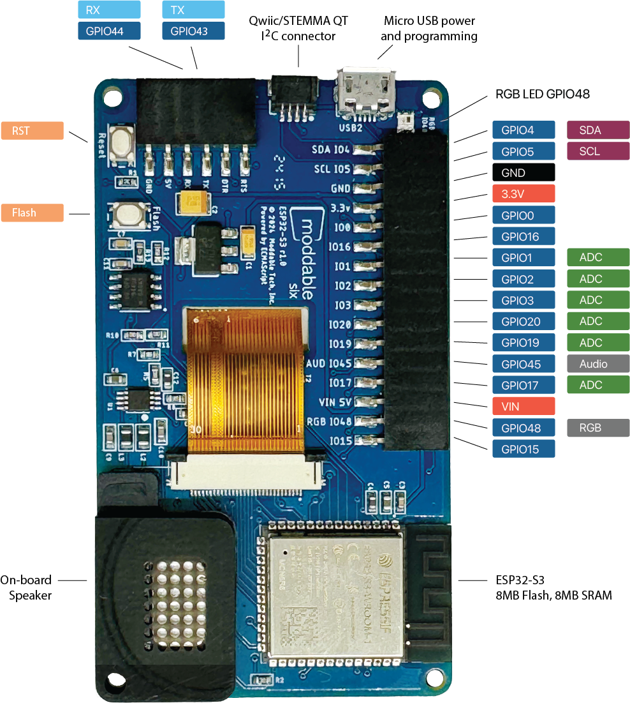

<a id="pin-info"></a>
### Pin Information

#### 6-pin Programming Header Description

| Name | Function | Description |
| :---: | :---: | :--- |
| RTS | I/O | Connects to auto programming and reset circuit |
| DTR | I/O | Connects to auto programming and reset circuit |
| TX | I/O | Connects to ESP32-S3 GPIO 43 |
| RX | I/O | Connects to ESP32-S3 GPIO 44 |
| 5V | PWR | 5V input connects to LM1117-3.3 voltage regulator and 5V pin on 16-pin external connector |
| GND | GND | Connects to GND |

#### 16-pin External Header Description

| Name| Function| Description |
| :---: | :---: | :--- |
| SDA&nbsp;IO4 | I/O | Connects to ESP32-S3 GPIO 4 (standard SDA, no external pull up resistor) |
| SCL&nbsp;IO5 | I/O | Connects to ESP32-S3 GPIO 5 (standard SCL, no external pull up resistor) |
| GND     | GND | Connects to GND |
| 3.3V    | I/O | 3.3V input and output. Connects to ESP32-S3 3.3V input and other 3.3V IC's. Regulated output power if board is 5V powered via micro USB, VIN external connector or programming connector. 3.3V is the output of the LM1117-3.3. Output of the LM1117 is conditioned with a 100uf Tantalum capacitor. |
| IO0     | I/O | Connects to ESP32-S3 GPIO 0. Pressing the Flash button on the device grounds this pin. It is also used in the auto-programming circuitry. |
| IO16    | I/O | Connects to ESP32-S3 GPIO 16, Analog |
| IO1     | I/O | Connects to ESP32-S3 GPIO 1, Analog |
| IO2     | I/O | Connects to ESP32-S3 GPIO 2 |
| IO3     | I/O | Connects to ESP32-S3 GPIO 3, Analog |
| IO19    | I/O | Connects to ESP32-S3 GPIO 19, USB D- |
| IO20    | I/O | Connects to ESP32-S3 GPIO 20, USB D+, Analog |
| AUD&nbsp;IO45 | I/O | Connects to ESP32-S3 GPIO 45, Audio signal |
| IO17    | I/O | Connects to ESP32-S3 GPIO 17, Analog |
| VIN 5V  | I/O | VIN is a 5V pin that can be used to power  Moddable Six. If the board is powered by one of the other 5V inputs this pin can be used for external 5V power. This is an unregulated pin; VIN is a direct connection to the 5V input sources. Connects to other 5V inputs and LM1117-3.3 voltage regulator. |
| RGB&nbsp;IO48    | I/O | Connects to ESP32-S3 GPIO 48, NeoPixel |
| IO15    | I/O | Connects to ESP32-S3 GPIO 15, Analog |

#### Power

Moddable Six is a 3.3V device. 5V power is regulated to 3.3V by a LM1117-3.3 voltage regulator (see data sheet for specs). Testing of Moddable Six has been with typical 5V 0.5amp USB source power.

Power can be supplied to Moddable Six via the following:

* 5V - Micro USB connector
* 5V - Moddable Programmer connector
* 5V - VIN on 16 pin external header
* 3.3V - 3.3V pin external header

<a id="dimensions"></a>
### Dimensions

The complete dimensions of Moddable Six are provided in this [PDF document](../assets/devices/moddable-six-dimensions.pdf). These are helpful when mounting Moddable Six in a product enclosure and designing a case for Moddable Six.

<a id="setup"></a>
## Moddable SDK and Host Environment Setup

To build and run apps on Moddable Six, you'll need to:

1. Install the [Moddable SDK](./../Moddable%20SDK%20-%20Getting%20Started.md)
2. Install [ESP32 tools](./esp32.md)
3. Follow the instructions in the **Building and Deploying Apps** section below.

<a id="building-and-deploying-apps"></a>
## Building and Deploying Apps

After you've set up your host environment and ESP32 tools, take the following steps to install an application on your Moddable Six.

Moddable Six has both a USB port and serial programmer port. You can program and debug with xsbug over either port. The serial programmer port requires a Moddable Programmer or other USB to serial adapter.

<a id="install-over-usb"></a>
To use the USB port:

1. Connect a USB cable to the USB connector on Moddable Six

2. Use the platform `-p esp32/moddable_six_cdc`

3. Build and deploy the app with `mcconfig`

	`mcconfig` is the command line tool to build and launch Moddable apps on microcontrollers and the simulator. Full documentation of `mcconfig` is available [here](../tools/tools.md).

	Use the platform `-p esp32/moddable_six_cdc`  with `mcconfig` to build for Moddable Six using the USB port. For example, to build the [`piu/balls` example](../../examples/piu/balls):

	```text
	cd $MODDABLE/examples/piu/balls
	mcconfig -d -m -p esp32/moddable_six_cdc
	```

<a id="install-over-serial"></a>
Alternately, to connect with a serial programmer:

1. Attach the programmer to the serial connector on Moddable Six

	Make sure you have the programmer oriented correctly. The orientation should match the image below.

	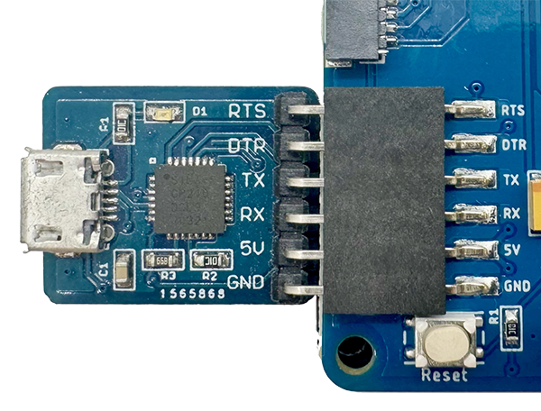

2. Attach the programmer to your computer with a micro USB cable

	Make sure you're using a data sync&#8211;capable cable, not one that is power-only.

3. Build and deploy the app with `mcconfig`.

	`mcconfig` is the command line tool to build and launch Moddable apps on microcontrollers and the simulator. Full documentation of `mcconfig` is available [here](../tools/tools.md).

	Use the platform `-p esp32/moddable_six`  with `mcconfig` to build for Moddable Six using the Moddable Programmer. For example, to build the [`piu/balls` example](../../examples/piu/balls):

	```text
	cd $MODDABLE/examples/piu/balls
	mcconfig -d -m -p esp32/moddable_six
	```

The [examples readme](../../examples) contains additional information about commonly used `mcconfig` arguments for screen rotation, Wi-Fi configuration, and more.

Use the platform `-p sim/moddable_six` with `mcconfig` to build for the Moddable Six simulator.

<a id="moddable-features"></a>
## Using Moddable Six
Moddable Six packs a large number of hardware features into a deceptively simple package. This section introduces what you need to know for your software to use all that hardware.

<a id="additional-memory"></a>
#### 8 MB PSRAM Memory
The ESP32-S3 in Moddable Six has about 512 KB of internal memory and another 8 MB of external PSRAM. The PSRAM is connected via a high-speed 8-bit bus, but it is still slower than the internal 512 KB of RAM.

The default JavaScript virtual machine for Moddable Six is 162 KB with an 8 KB stack, a 77 KB slot heap, and a 77 MB chunk heap. This is enough memory for many projects and ensures that all the JavaScript virtual machine memory is allocated in the fast internal memory. You can make a virtual machine that uses much more memory, over 8 MB. To do this, add a `"creation"` section to your project's `manifest.json`. Here's an example that creates a 4 MB virtual machine with a 32 KB stack, 2032 KB slot heap, and 2032 KB chunk heap:

```json
"creation": {
	"static": 0,
	"chunk": {
		"initial": 2080768,
		"incremental": 0
	},
	"heap": {
		"initial": 130048,
		"incremental": 0
	},
	"stack": 2048
}
```

The `"chunk"` values are in units of bytes while the`"stack"` and `"heap"` values are in units of  "slots" (each slot is 16 bytes on ESP32-S3). See the [manifest documentation](https://github.com/Moddable-OpenSource/moddable/blob/public/documentation/tools/manifest.md#creation) for more information on the `"creation"`.

Another way to take advantage of all that memory is to divide your project into multiple independent Web Workers. That's discussed in the next section.

<a id="dual-core"></a>
#### Dual-Core ESP32-S3 CPU
The Moddable SDK makes it easy to take advantage of the two CPU cores in the ESP32-S3. The standard Web Worker API allows you to run scripts in parallel on the two cores. For example, one worker might be used for the user interface, another for network communications, and a third for processing sensor readings. This separation ensures that the user interface remains responsive by avoiding any blocking from other work taking place. It can also help to organize code and minimize interactions between different parts of a project's code.

Each Web Worker is an independent JavaScript virtual machine. Each Worker runs in a separate FreeRTOS task which allows them to run in parallel on the dual-core ESP32-S3. Workers communicate by sending messages or `SharedArrayBuffer` objects.

The 8 MB PSRAM on Moddable Six can contain about 40 virtual machines using the default creation configuration of 177 KB.

To learn more about Web Workers in the Moddable SDK, read an the [documentation](https://github.com/Moddable-OpenSource/moddable/blob/public/documentation/base/worker.md) and try running [an example](https://github.com/Moddable-OpenSource/moddable/tree/public/examples/base/worker).

#### Beautiful, Fast and Responsive screen

The touch screen is a 240 x 320 QVGA IPS display driven by a 8 bit wide parallel data bus with a GT911 capacitive touch controller.

<a id="backlight"></a>
#### Backlight

Example: [backlight](https://github.com/Moddable-OpenSource/moddable/tree/public/examples/piu/backlight)

Moddable Six has a backlight that can be adjusted in software.

The backlight control is connected to GPIO 14. There is a constant defined for the backlight GPIO in the host `config`.

```js
import "config" from "mc/config";

Digital.write(config.backlight, 1); // backlight ON
Digital.write(config.backlight, 0); // backlight OFF
```

The brightness of the backlight may be set at build time in the `config` section of your project manifest. The default is 100%.

```js
"config": {
    "brightness": 75
}
```

You can also set the brightness on the command line when building with `mcconfig`. Here it is set to 50%.

```text
mcconfig -d -m -p esp32/moddable_six_cdc brightness=50
```

The `setup/target` module for Moddable Six installs a global variable named `backlight` that you can use to adjust the backlight in your code. Here it is set to 80%.

```js
backlight.write(80);
```

The `backlight` global contains an instance of a subclass of `PWM`. If you do not want this to be created automatically, set the brightness to `"none"` in the `config` section of your project's manifest.

```js
"config": {
    "brightness": "none"
}
```

<a id="frame-rate-control"></a>
#### Dynamic Frame Rate Control

The screen on Moddable Six can operate at refresh rates between 30 and 100 frames per second. The default is 50 FPS. The frame rate can be adjusted by your project code:

```js
screen.frameRate = 75;
```

The optimal hardware refresh rate for the display depends on the animation design and how quickly the ESP32-S3 inside Moddable Six is able to render the frames.

<a id="tearing-effect"></a>
#### Tearing Effect

The display controller in Moddable Six has a "tearing effect" output. This is used to eliminate visible tearing on screen by synchronizing the refresh of the screen with the hardware refresh. This provides a much more stable display and smoother animation. However, if the frames cannot be rendered quickly enough, they will still tear. In that case, either use the frame rate control to reduce the rendering frame rate or optimize the animations. In some cases it may be preferable to disable use of the tearing effect pin. This can be done in your project's script:

```js
screen.syncFrames = false;
```

The tearing effect output of the display controller is connected to GPIO 47 of the ESP32-S3. It is managed by the ILI9341_P8 display driver, and so should not be used by your code if you are using the display driver.

<a id="amplified-audio"></a>
#### Amplified Audio

Examples: [somafm](https://github.com/Moddable-OpenSource/moddable/tree/public/contributed/somafm)
[resource-stream](https://github.com/Moddable-OpenSource/moddable/tree/public/examples/pins/audioout/resource-stream)
[mp3-resource-stream](https://github.com/Moddable-OpenSource/moddable/tree/public/examples/pins/audioout/mp3-resource-stream)

Moddable Six plays audio using [PDM](https://en.wikipedia.org/wiki/Pulse-density_modulation) through a [PAM8302A](https://www.diodes.com/part/view/PAM8302A?BackID=8156) amplifier.

The audio signal is output on GPIO 45. Pin IO45 can also be found on the expansion header. The signal on IO45 is the unfiltered, unamplified PDM output directly from the ESP32-S3. This may be used to drive your own external filter, amplifier, and speaker. The output of the amplifier goes only to the onboard speaker, not to Pin IO45. If your project does not play audio, PIN IO45 is available to use as a GPIO.

GPIO 46 enables the PAM8302A amplifier connected to the onboard speaker. Power to the amplifier is automatically applied when audio is playing. When no audio is playing, the amplifier is turned off.

<a id="quick-connector"></a>
#### STEMMA QT / Qwiic / JST SH 1mm Quick Connector

Moddable Six has a JST SH 1mm connector, commonly referred to as [Qwiic](https://www.sparkfun.com/qwiic) or [STEMMA QT](https://learn.adafruit.com/introducing-adafruit-stemma-qt/what-is-stemma-qt), that is used to easily connect sensors and peripherals using the I²C protocol. It uses GPIO 4 for SDA and GPIO 5 for SCL.

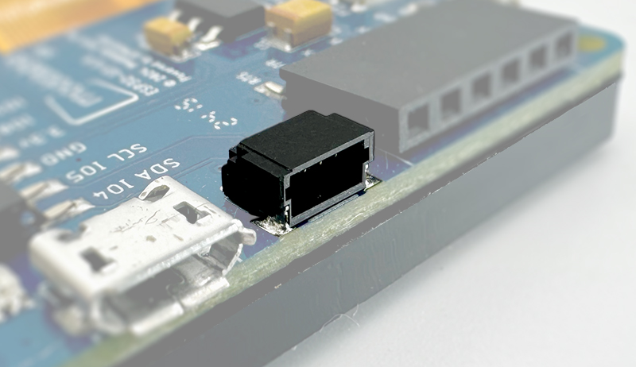

<a id="neopixel"></a>
#### NeoPixel

Example: [neopixel](https://github.com/Moddable-OpenSource/moddable/tree/public/examples/drivers/neopixel)

There is a NeoPixel on the main board which is controlled using GPIO 48.

Moddable Six can color cycle the NeoPixel while running by enabling the `rainbow` option in the led config. To use the NeoPixel in your application or to use pin IO48 as a GPIO, set the `rainbow` configuration option in your project manifest to `false`.

```js
"config": {
    "led": {
        "rainbow": false
    }
}
```

A NeoPixel strip can be connected to pin RGB IO48 on the expansion header.

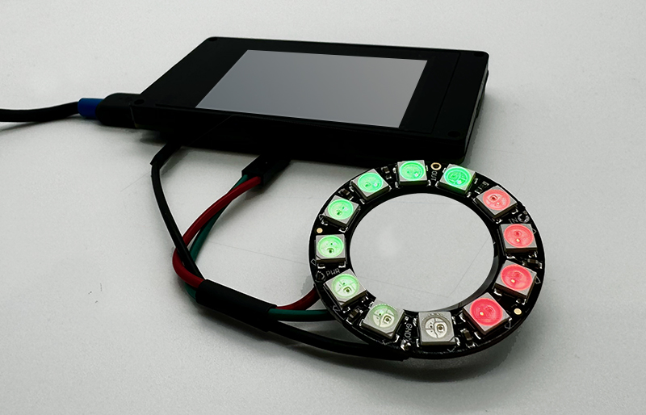

> Note: Please provide external 5V power to your NeoPixel strip. With 3.3V power, the NeoPixel strip may not work correctly. For short NeoPixel strips, you can use the `VIN 5V` pin when Moddable Six is powered by a 5V supply.

<a id="usb"></a>
#### USB

The USB port is connected to GPIO 19 and GPIO 20. This port can be used to program and debug Moddable Six. For more information on USB on the ESP32 family see the [USB section of our ESP32 documentation](https://github.com/Moddable-OpenSource/moddable/blob/public/documentation/devices/esp32.md#using_usb).

If your project does not use USB and you are not building with the target `esp32/moddable_six_cdc` you can use IO19 and IO20 on the expansion header as GPIOs.

<a id="touch-panel"></a>
#### Touch Panel
The touch panel uses a GT911 touch controller connected to the I²C bus on GPIO 4 and GPIO 5. It uses I²C address `0x14` or `0x5D`.

The GT911 touch controller interrupt is connected to GPIO 38. The GT911 touch driver uses the interrupt to detect touch events, making the touch panel more responsive and eliminating the need to continuously poll for touch events.

You cannot use IO4 and IO5 as GPIOs if your project uses the touch panel. You can use these pins with other I²C devices even if your project uses the touch panel as long as those devices don't use I²C addresses `0x14` or `0x5D`.

<a id="flash-button"></a>
#### Flash Button

The flash button on the back of Moddable Six may be used as an input to your project. It is connected to GPIO0 and may be accessed using Digital Input APIs. However, it is recommended to use the global `Host` object to access it instead, as this is a bit simpler, portable to other devices, and works in the Moddable Six simulator. Here's an example:

```js
new Host.Button.Default({
	onPush() {
		trace(`Button pressed ${this.pressed}\n`);
	}
});
```

<a id="troubleshooting"></a>
## Troubleshooting

Moddable Six can communicate with your development computer using either its USB or Serial connector. If you are using the USB connector, build using the `esp32/moddable_six_cdc` platform. If you are using the Serial connector, build using the `esp32/moddable_six` platform.

<a id="development-resources"></a>
## Development Resources

<a id="simulator"></a>
### Simulator

The Moddable SDK simulator, mcsim, includes a simulator for Moddable Six. The simulator is a valuable tool to quickly develop and debug many parts of your project.

To use the Moddable Six simulator, specify the `sim/moddable_six` platform when building with `mcconfig`:

```
mcconfig -d -m -p sim/moddable_six
```

The Moddable Six simulator simulates the following:

- QVGA Display
- Touch input
- Audio playback
- NeoPixel LED
- Web Workers
- Wi-Fi
- Flash button

The Controls panel in the simulator has a button labeled "Default" which simulates the Flash button on the back of Moddable Six. Use "Show Controls" in the View menu to show the Controls panel.

<a id="examples"></a>
### Examples

The Moddable SDK has over 150 [example apps](../../examples) that demonstrate how to use its many features. Most of these examples are compatible with Moddable Six.

A suite of example apps designed for Moddable Six is in
 the [contributed/moddable_six](../../contributed/moddable_six) directory. These apps demonstrate Moddable Six features including high frame rate animation, audio integration in the UI, touch interactions, and vector graphics. These apps can also be run in the Moddable Six simulator on macOS, Windows, and Linux using the platform `sim/moddable_six` with `mcconfig`.

These apps are great starting points for your own projects. They can be easily adapted to communicate with your hardware, change the UI interactions, or add new features.

#### battery

The [battery](../../contributed/moddable_six/battery) app is a control panel for a home battery system. It uses a simulated battery.

The app includes advanced rendering of battery levels with fluid animations and sophisticated screen-to-screen transitions.

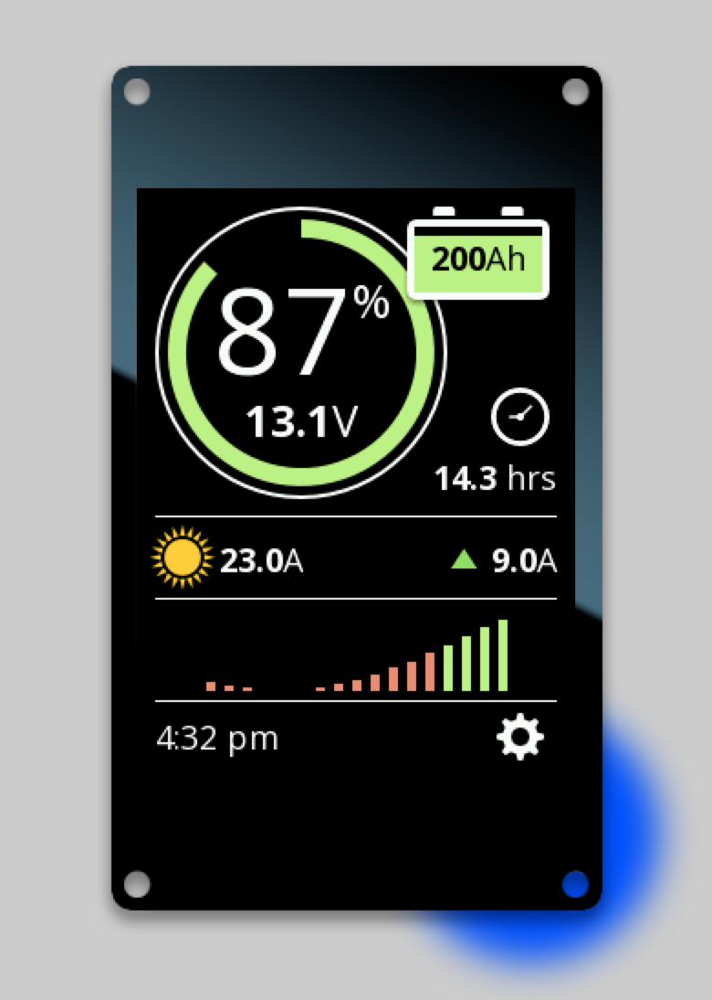 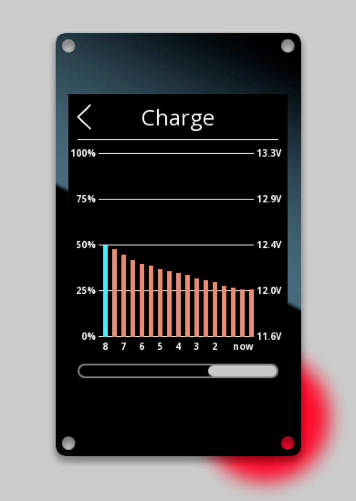

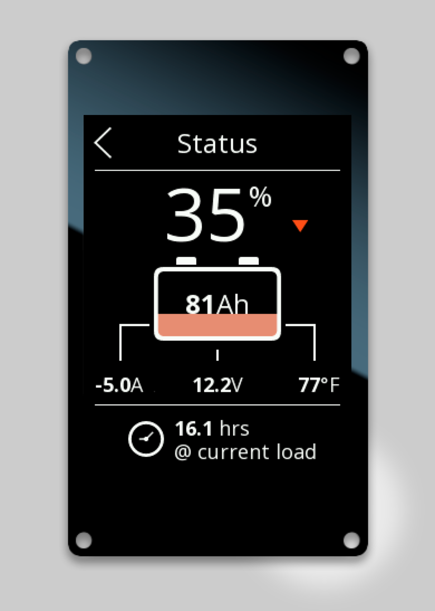 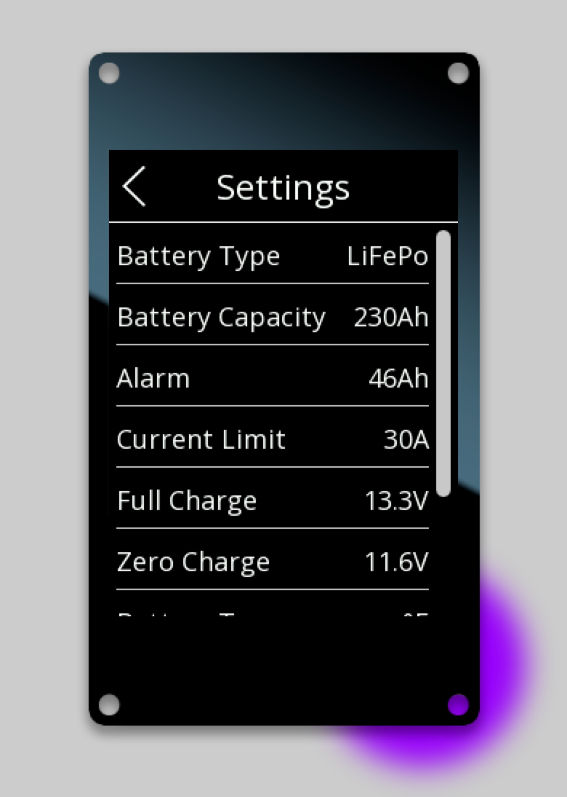


#### led-color

The [led-color](../../contributed/moddable_six/led-color) app provides a color-picker on display for the user to choose the color displayed by the on-board Neopixel.

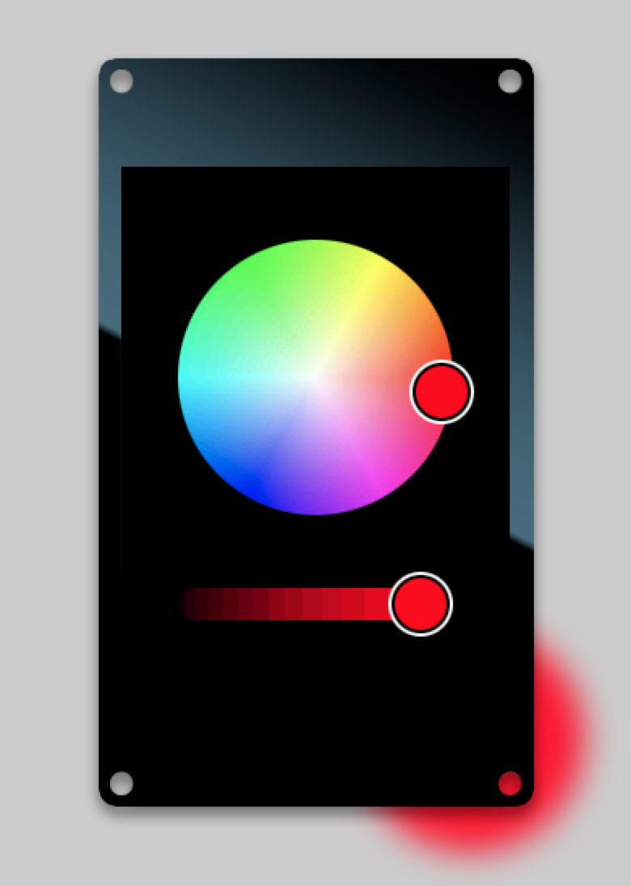 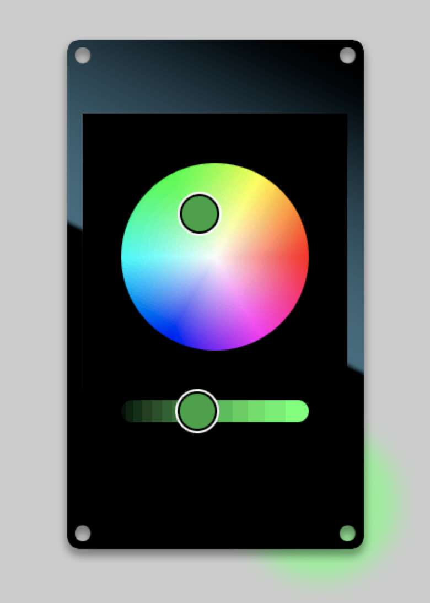

#### plug-schedule

The [plug-schedule](../../contributed/moddable_six/plug-schedule) app presents an interface for an IoT plug plug.

This is the largest, most comprehensive of the the Moddable Six example apps. It is nearly a complete product. It maintains separate schedules for two smart plugs and includes Wi-Fi configuration, setting the time, and an graphical timezone picker. The mobile-stye UI features smooth, flicker free animations are reinforced with audio feedback.

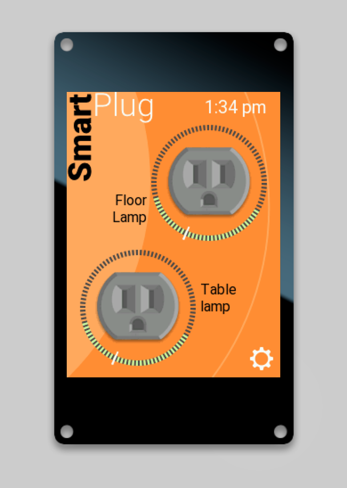 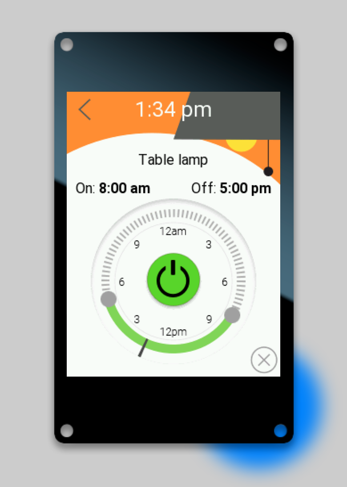

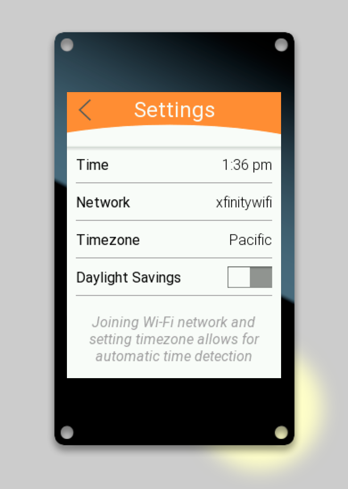 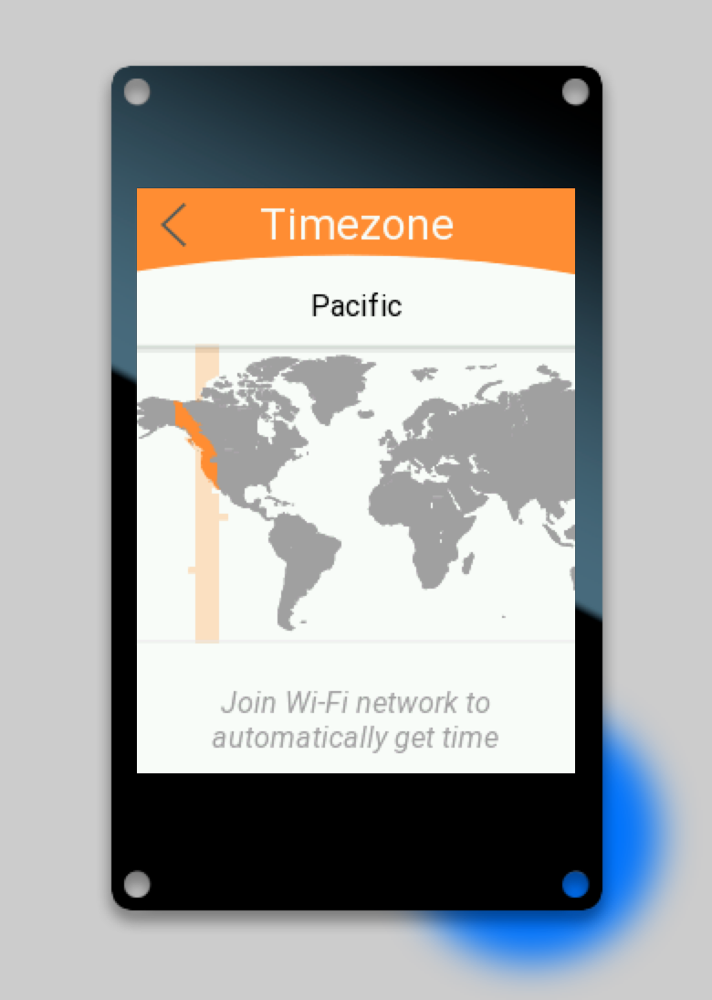


#### speaking-clock

The [speaking-clock](../../contributed/moddable_six/speaking-clock) app is a word-clock that audibly announces the time every minute.

The voice of the speaking clock is ChatGPT! The voice samples were captured from ChatGPT and built into the app. They are stored in WAVE files so you can easily replace them with any voice you like, even your own.

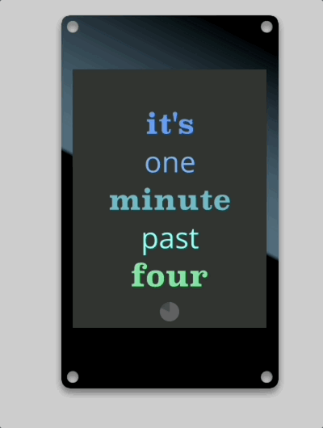

<a id="debugging"></a>
### Debugging

Moddable Six has advanced debugging support for JavaScript, TypeScript, and native code.

<a id="advanced-xsbug"></a>
#### Debugging JavaScript and TypeScript Code

The xsbug debugger included in the Moddable SDK is used to debug both JavaScript and TypeScript code. The [xsbug documentation](https://github.com/Moddable-OpenSource/moddable/blob/public/documentation/xs/xsbug.md) explains the fundamentals. There's nothing special to do to debug TypeScript: xsbug support source maps, so TypeScript debugging works automatically. xsbug supports debugging multiple JavaScript virtual machines at the same time, so you can debug Web Workers too.

Once you are comfortable with the basics of xsbug, check out these blog posts to learn about advanced debugging features built into xsbug.

- [Conditional breakpoints](https://moddable.com/blog/conditional-breakpoints/)
- [Function breakpoints](https://www.moddable.com/blog/function-breakpoints/)
- [Tracepoints](https://www.moddable.com/blog/tracepoints/)

<a id="debug-native"></a>
#### Debugging Native Code

Debugging native code on Moddable Six uses the GDB debugger.

[GDB](https://www.gnu.org/software/gdb/documentation/) is the GNU debugger widely used on Unix-like build hosts to debug native code. GDB is included in the Espressif Toolchain downloaded during the [SDK and Host Environment Setup](#setup) step.

GDB communicates with Moddable Six over the USB port.

> **Note**: GDB is an extremely powerful tool that takes some time to learn. GDB support on the ESP32-S3 has some limitations that make using it more challenging, such as supporting only two hardware breakpoints.

##### GDB Setup

1. OpenOCD allows GDB to communicate with the ESP32-S3. If you followed the instructions from Espressif to set up the ESP-IDF, you should already have OpenOCD set-up. See the Espressif documentation for instructions to [confirm that OpenOCD is installed](https://docs.espressif.com/projects/esp-idf/en/stable/esp32s3/api-guides/jtag-debugging/#jtag-debugging-setup-openocd).

2. Create a GDB startup command text file `.gdbinit` in your `$HOME` directory with the following contents:

```
target extended-remote :3333
set remote hardware-watchpoint-limit 2
mon reset halt
file xs_esp32.elf
flushregs
thb app_main
c
```

> Note: you may already have a `.gdbinit` in your `$HOME` directory. If so, you may want to move it aside or rename it.

##### Debugging with GDB

1. Build the app that contains the native code you plan to debug. For this example, we build the [SomaFM example](https://github.com/Moddable-OpenSource/moddable/tree/public/contributed/somafm):

```
cd $MODDABLE/contributed/somafm
mcconfig -d -m -p esp32/moddable_six ssid="YOU WI-FI ACCESS POINT" password="YOUR WI-FI PASSWORD"
```

> **Note**: To use GDB, connect Moddable Six to your computer using the USB port on Moddable Six, not the serial port. GDB is only supported over the USB port. If you want to use xsbug at the same time as GDB, you can also connect the serial port to your computer using a Moddable Programmer.

2. In a new Terminal window, start OpenOCD

```
openocd -f board/esp32s3-builtin.cfg
```

3. In a Terminal window, navigate to the `bin/` directory for your application.

```
cd $MODDABLE/build/bin/esp32/moddable_six/debug/somafm
```

4. Launch GDB

```
xtensa-esp32s3-elf-gdb
```

Some startup information will scroll by and the application will stop in `app_main()`:

```
Thread 2 "main" hit Temporary breakpoint 1, app_main () at /Users/mkellner/moddable/build/tmp/esp32/moddable_six_cdc/debug/somafm/xsProj-esp32s3/main/main.c:477
477		void app_main() {
```

5. Use GDB

	At this point, you can use GDB as you normally would, setting breakpoints, inspecting variables, memory or registers, etc.

```
(gdb) break xs_audioout
(gdb) c
```

<a id="documentation"></a>
### Documentation

All the documentation for the Moddable SDK is in the [documentation](../) directory. The **documentation**, **examples**, and **modules** directories share a common structure to make it straightforward to locate information. Some of the highlights include:

- The `commodetto` subdirectory, which contains resources related to Commodetto--a bitmap graphics library that provides a 2D graphics API--and Poco, a lightweight rendering engine.
- The `piu` subdirectory, which contains resources related to Piu, a user interface framework that makes it easier to create complex, responsive layouts.
- The `networking` subdirectory, which contains networking resources related to BLE, network sockets, and a variety of standard, secure networking protocols built on sockets including HTTP/HTTPS, MQTT, WebSockets, DNS, SNTP, and telnet.
- The `io` subdirectory, which contains resources related to supported hardware protocols (digital, analog, PWM, I²C, etc.) using ECMA-419. A number of drivers for common off-the-shelf sensors and corresponding example apps are also available.

<a id="Support"></a>
### Support

If you have questions, we recommend you [open a discussion](https://github.com/Moddable-OpenSource/moddable/discussions). We'll respond as quickly as practical, and other developers can offer help and benefit from the answers to your questions. Many questions have already been answered, so please try searching previous discussions and issues before opening a new one.

<a id="Updates"></a>
### Updates

The best way to keep up-to-date with what we're doing is to follow us on Twitter ([@moddabletech](https://twitter.com/moddabletech)). We post announcements about new posts on [our blog](http://blog.moddable.com/) there, along with other Moddable news. To learn about the latest Moddable SDK releases, subscribe to our [Releases on GitHub](https://github.com/moddable-OpenSource/moddable/releases) by Watching our [repository](https://github.com/Moddable-OpenSource/moddable).

